## |> 數據類型

> 分類：

基本（值）類型：

1. String：任意字符串
2. Number：任意數字
3. boolean：true/false
4. undefined：undefined
5. null：null

對象（引用）類型：

1. Object：任意對象（屬性：值）
2. function：一種特別的對象（可以執行）
3. Array：一種特別的對象（屬性是數值下標，內部數據是有序的）

> 判斷

1. typeof ： return String -->	' lowercase string'

   - 可以判斷 ： undefined 類型 / 數值類型 /function

   - 不能判斷：null / object ---> 兩這結果都是 object ，無法區分

     ​						array / object --->  兩這結果都是 object ，無法區分

2. instanceof：判斷對象的`具體`類型

   

3. === (==會自動做數據轉換)

   - 可以判斷：undefined 類型 / null類型 ---> 因為這兩個類型只有一個值

```javascript
// 基本（值）類型：
var a
console.log(a, typeof a,typeof a==='undefined', a===undefined) // undefined 'undefined' true true
console.log(undefined === 'undefined') //false

a=3
console.log(typeof a==='number') // true
a='dga'
console.log(typeof a==='string', typeof a==='String') // true false ---> s must be lowercase
a=true
console.log(typeof a==='boolean') // true
a=null
console.log(typeof a, a===null) //'object' true

// 對象（引用）類型：
var b1 = {
  b2: [1, 'ewgf', console.log],
  b3: function(){
    console.log('b3')
    return function(){
      return 'hello'
    }
  }
}
// A instanceof B : A 是不是 B 類型的實例
// new Object() --->  Object 是一個構造函數
console.log(b1 instanceof Object, b1 instanceof Array) // true false
console.log(b1.b2 instanceof Array, b1.b2 instanceof Object) // true true
console.log(b1.b3 instanceof Function, b1.b3 instanceof Object) // true true
console.log(typeof b1.b2) //'object'
console.log(typeof b1.b3==='function') // true
console.log(typeof b1.b2[2]==='function') // true
b1.b2[2](4) // 4
console.log(b1.b3()()) // hello
```

Null

```js
var b = null	// initiallized with null, indicated that this value wou;d be use as object
b = ['gsr', 44] // object賦值
b = null // 釋放資源，讓b指向的對象成為垃圾對象（被垃圾回收器回收）
```

Conclusion

```js
1. undefined與null的區別?
  * undefined代表變量沒有賦值
  * null: 代表變量賦值了, 只是值為null
2. 什麼時候將變量賦值為null?
  * 初始化賦值: 將要作為引用變量使用, 但對像還沒有確定
  * 結束時: 將變量指向的對象成為垃圾對象
3. 理解變量類型與數據類型?
  * js的變量本身是沒有類型的, 變量的類型實際上是變量內存中數據的類型
  * 變量類型:
    * 基本類型: 保存基本類型數據的變量
    * 引用類型: 保存對像地址值的變量
  * 數據對象
    * 基本類型
    * 對像類型

數據類型的分類和判斷
基本(值)類型

Number ----- 任意數值 -------- typeof

String ----- 任意字符串 ------ typeof

Boolean ---- true/false ----- typeof

undefined --- undefined ----- typeof/===

null -------- null ---------- ===

對象(引用)類型

Object ----- typeof/instanceof

Array ------ instanceof

Function ---- typeof
```

### typeof, instanceof, isPrototypeOf()方法的區別

- typeof是一個運算符，`用於檢測數據的類型`，比如基本數據類型null、undefined、string、number、boolean，以及引用數據類型object、function，但是對於正則表達式、日期、數組這些引用數據類型，它會全部識別為object；
- instanceof同樣也是一個運算符，它就能很好識別`數據具體是哪一種引用類型`。它與isPrototypeOf的區別就是它是用來檢測 `構造函數的原型` 是否存在於指定對象的原型鏈當中；
- 而isPrototypeOf是用來檢測調用此 `方法的對像` 是否存在於指定對象的原型鏈中，所以本質上就是`檢測目標不同`。

[instanceof 与 isPrototypeOf 的区别](https://www.jianshu.com/p/31b09a13f212)

B instanceof A：

- A構造函數的prototype對像 是否在B的原型鏈上

A.isPrototypeOf(B)：

- A對像 是否在B的原型鏈上


[instanceof 与 Object.isPrototypeOf 的区别](https://aaron-bird.github.io/2020/04/17/instanceof%20%E4%B8%8E%20Object.isPrototypeOf%20%E7%9A%84%E5%8C%BA%E5%88%AB/)

- `Aobj instanceof Bfunction` // Bfunction.prototype 是否在 Aobj.__proto__ (A 的原型鏈)上 ?
- `Aobj.isPrototypeOf(Bobj)` // Aobj 是否在 Bobj.__proto__ (B 的原型鏈)上?

instanceof正是通過探測`obj.__proto__.__proto__... === Constructor.prototype`來驗證obj是否是Constructor的實例。

instanceof 用於判斷"左側的對象"是否是"右側的構造函數"生成的實例.

相當於:

```js
function instance(Aobj, Bfunction) {
  let proto = Aobj.__proto__;
  while (proto) {
    if (proto === Bfunction.prototype) {
      return true;
    } else {
      proto = proto.__proto__;
    }
  }
  return false;
}

class Parent {}
class Child extends Parent {}
class Grandson extends Child {}

var c = new Child();
instance(c, Parent); // true
instance({}, Parent); // false
instance(c, Object); // true

var g = new Grandson();
instance(g, Parent); // true
```

而 isPrototypeOf 用於判斷"左側的對象"是否在"右側的對象"的原型鏈上, 即"右側的對象"是否會繼承"左側的對象"上的屬性和方法.

相當於

```js
function isPrototype(Aobj, Bobj) {
  let proto = Bobj.__proto__;
  while (proto) {
    if (proto === Aobj) {
      return true;
    } else {
      proto = proto.__proto__;
    }
  }
  return false;
}

class Parent {}
class Child extends Parent {}
class Grandson extends Child {}

isPrototype(Parent, Grandson); // true
```

示例

```js
class Parent {}
class Child extends Parent {}
class Grandson extends Child {}

Parent instanceof Child; // false
Child instanceof Parent; // false

Parent.isPrototypeOf(Child); // true
Child.isPrototypeOf(Parent); // false
Parent.isPrototypeOf(Grandson); // true

Parent.prototype.isPrototypeOf(Child.prototype); // true
Child.prototype.isPrototypeOf(Parent.prototype); // false

var c = new Child();
c instanceof Child; // true
c instanceof Parent; // true
c.isPrototypeOf(Child); // false
c.isPrototypeOf(Parent); // false
Child.isPrototypeOf(c); // false
Parent.prototype.isPrototypeOf(c.__proto__); // true

Child.__proto__ === Parent; // true
```


## |> 內存/記憶體memory

```js
1. 什麼是數據?
  * 存儲於內存中代表特定信息的'東東', 本質就是0101二進制
  * 具有可讀和可傳遞的基本特性
  * 萬物(一切)皆數據, 函數也是數據
  * 程序中所有操作的目標: 數據
    * 算術運算
    * 邏輯運算
    * 賦值
    * 調用函數傳參
    ...
2. 什麼是內存?
  * 內存條通電後產生的存儲空間(臨時的)
  * 產生和死亡: 內存條(集成電路板)==>通電==>產生一定容量的存儲空間==>存儲各種數據==>斷電==>內存全部消失
  * 內存的空間是臨時的, 而硬盤的空間是持久的
  * 分配內存: 聲明變量和函數或創建對象時, JS引擎會自動為此分配一定大小的內存來存放對應的數據
  * 釋放內存: 清空內存中的數據, 標識內存可以再分配使用(內存不釋放就不能複用)
    * 自動釋放: 棧空間的局部變量
    * 垃圾回調器回調: 堆空間的垃圾對象
  * 一塊內存包含2個數據
    * 內部存儲的數據(一般數據/地址數據)
    * 內存地址值數據
  * 內存分類
    * 棧: 全局變量, 局部變量 (空間較小)
    * 堆: 對象 (空間較大)
3. 什麼是變量?
  * 值可以變化的量, 由變量名與變量值組成
  * 一個變量對應一塊小內存, 變量名用來查找到內存, 變量值就是內存中保存的內容
4. 內存,數據, 變量三者之間的關係
  * 內存是一個容器, 用來存儲程序運行需要操作的數據
  * 變量是內存的標識, 我們通過變量找到對應的內存, 進而操作(讀/寫)內存中的數據

1. 問題1: var a = xxx, a內存中到底保存的是什麼?
  * xxx是一個基本數據
  * xxx是一個對象
  * xxx是一個變量

2. 關於引用變量賦值問題
  * 2個引用變量指向同一個對象, 通過一個引用變量修改對象內部數據, 另一個引用變量也看得見
  * 2個引用變量指向同一個對象,讓一個引用變量指向另一個對象, 另一個引用變量還是指向原來的對象

3. 問題: 在js調用函數時傳遞變量參數時, 是值傳遞還是引用傳遞?
  * 只有值傳遞, 沒有引用傳遞, 傳遞的都是變量的值, 只是這個值可能是基本數據, 也可能是地址(引用)數據
  *  如果後一種看成是引用傳遞, 那就值傳遞和引用傳遞都可以有

4. 問題: JS引擎如何管理內存?
  1. 內存生命週期
    1). 分配需要的內存
    2). 使用分配到的內存
    3). 不需要時將其釋放/歸還
  2. 釋放內存
    * 為執行函數分配的棧空間內存: 函數執行完自動釋放
    * 存儲對象的堆空間內存: 當內存沒有引用指向時, 對象成為垃圾對象, ​​垃圾回收器後面就會回收釋放此內存
```

## |> object

```js
1. 什麼是對象?
  * 代表現實中的某個事物, 是該事物在編程中的抽象
  * 多個數據的集合體(封裝體)
  * 用於保存多個數據的容器
2. 為什麼要用對象?
  * 便於對多個數據進行統一管理

composition of Object -->
  屬性：
		* 代表現實事物的狀態數據
		* 屬性名（String）, 屬性值（任意）組成
  方法：
		* 代表現實事物的行為數據     
  	* 是特別的屬性==>屬性值是函數

how to get inner data of Object?
	.屬性名 : 
			sometime cannot use this，
			1. 像是屬性名包含特殊字符: 空格, -
			2. 變量名不確定(is a variable)
					let propName = "myAge"
          let value = 20
          // p.propName = value --> cannot use . to set prop
          p[propName] = value

	['屬性名'] :通用
```

## |> function

```js
1. what is function
		* 實現特定功能的多條語句封裝體
		* only function is executable, other 數據類型 cannot be executed
2. why need use function
		* make it reuseable
		* easier to read
3. how to define a function
		* 函數聲明
				function fn1(){
          console.log('fn1()');
        }
		* 表達式
				let fn2 = function(){
          console.log('fn2()');
        }
4. how to use(invoke) function
		* test() : invoke directly
		* obj.test() : invoke by object
		* new test() : new 調用
		* test.call/apply(obj) : 臨時讓 test 成為 obj 的方法進行調用
    
    		let obj = {}
    		function test2(){
          this.xxx = "laladance"
        }
				// obj.test2() 不能直接調用，因為 obj 沒有該屬性方法
        test2.call(obj) // 臨時讓一個 函數 成為 指定任意對象的方法 進行調用
        console.log(obj.xxx)
	

問題: 在js調用函數時傳遞變量參數時, 是值傳遞還是引用傳遞?   * 	
  * 只有值傳遞, 沒有引用傳遞, 傳遞的都是變量的值, 只是這個值可能是基本數據, 也可能是地址(引用)數據
```

## |> IIFEs

```html
1. 什麼函數才是回調函數
		1) you define it
    2) you did not invoke it
    3) but it was executed finally
2. 常見的回調函數
		* dom event回調函數
        <button id="btn">test</button>
        document.getElementById('btn').onclick() = function9){
          alert(this.innerHTML);
        }
		* 定時器回調函數
        setTimeout(function(){
          alert('timesup')
        }, 2000)
    * 請求回調函數
    * 生命週期回調函數
```

**IIFEs(Immediately Invoked Functions Expressions)**  === 匿名函數

```js
IIFEs(Immediately Invoked Functions Expressions) === 匿名函數
	* 全稱: Immediately-Invoked Function Expression 立即調用函數表達式   
  * 別名: 匿名函數自調用
1. 隱藏內部實現
2. 創造隔離的命名空間，避免污染外部/全局命名空間
3. js 模塊編寫

 ;(function(){
     let a = 1
     function test(){
       console.log(++a);
     }
     function test2(){
       console.log('test2'); // 隱藏 test2()
     }
   	 window.$ = function(){
       return{
         test: test // 向外暴露 test() 接口 
       }
     }
   }
	)()

	$().test() // 2
  // 1. $ is a function
	// 2. after $ was executed, it return an object
```

## |> this

> `this` 代表的是 **function 執行時所屬的物件，而不是 function 本身**

它是函數運行時，在函數體內部自動生成的一個對象，只能在函數體內部使用。

函數的不同使用場合，this有不同的值。總的來說，this就是函數運行時所在的環境對象。

### explain 1

綁定的 this 不同

- 傳統函式：依呼叫的方法而定
- 箭頭函式：綁定到其定義時所在的物件

#### 傳統函式

傳統函式：依呼叫的方法而定

結論 What's "this" in JavaScript?

綜合上述範例介紹，我們可以簡單總結出一個結論：

- 這個 function 的呼叫，是透過 `new` 進行的嗎？ 如果是，那 `this` 就是被建構出來的物件。
- 這個 function 是以 `.call()` 或 `.apply()` 的方式呼叫的嗎？ 或是 function 透過 `.bind()` 指定？ 如果是，那 `this` 就是被指定的物件。
- 這個 function 被呼叫時，是否存在於某個物件？ 如果是，那 `this` 就是那個物件。
- 如果沒有滿足以上條件，則此 function 裡的 this 就一定是**全域物件**，在嚴格模式下則是 `undefined`。

```js
1. what is this
	* 任何函數本質上都是通過某個對象來調用的，如果沒有直接指定就是 window
	* 所有函數內部都有一個變量 this
	* 他的值是調用函數的當前對象
2. how to 確認 this 的值
	* test(): window
	* p.test: p
  * new test(); 新創建的對象
  * p.call(obj): obj

function Person(color){
  console.log(this);
  this.color = color;
  this.getColor = function(){
    console.log(this);
    return this.color;
  };
  this.setColor = function(color){
    console.log(this);
    this.color = color;
  }
}

Person("red"); // window

let p = new Person("yellow"); // p

p.getColor(); // p

let obj = {};
p.setColor.call(obj, "black"); // obj

let test = p.setColor;
test(); // window

function func1() {
  function func2(){
    console.log(this);
  }
  func2(); // window
}
func1();
-------------------------------------------------------
var obj = {

  func1: function(){
    console.log( this === obj );

    var func2 = function(){
      // 這裡的 this 跟上層不同！
      console.log( this === obj );
    };

    func2();
  }
};

obj.func1();

  - 在 obj.func1() 裡面的 console.log( this === obj ); 會印出 true，原因是因為 func1 是透過 obj 來呼叫的。
  - 但 obj.func1() 裡面的 func2() 在執行時的 console.log( this === obj ); 卻會印出 false。

這裡必須說明兩個重點：
  - JavaScript 中，用來切分變數的最小作用範圍 (scope)，也就是我們說的有效範圍的單位，就是 function。
  - 當沒有特定指明 this 的情況下，預設綁定 (Default Binding) this 為 「全域物件」，也就是 window。
  - 換言之，在 func2 裡頭的 this，若是沒有特別透過 call() 、 apply() 或是 bind() 來指定 this 的話，那麼這裡的 this 就是 window。
```

#### 箭頭函式

箭頭函式：綁定到其定義時所在的物件 == this 會被綁定在當時"**所定義的作用域中**"

箭頭函數中，this由詞法/靜態作用域設置（set lexically）。它被設置為包含它的execution context的this，並且不再被調用方式影響（call/apply/bind）。

箭頭函數當中的 this 是定義時的對象，而不是使用時的對象

[箭頭函式](https://developer.mozilla.org/zh-TW/docs/Web/JavaScript/Reference/Functions/Arrow_functions)

箭頭函式並不擁有自己的 `this 變`數`；`使用的 this `值來自`封閉的文本上下文，也就是說，箭頭函式遵循常規變量查找規則。因此，如果在當前範圍中搜索不到 this 變量時，他們最終會尋找其封閉範圍。

因此，在以下程式碼內，傳遞給 `setInterval` 的 箭頭函式中的`this` ，會與封閉函式的 `this` 值相同：

```js
function Person(){
  this.age = 0;

  setInterval(() => {
    this.age++; // |this| 適切的參考了Person建構式所建立的物件
  }, 1000);
}

var p = new Person();
```


[鐵人賽：箭頭函式 (Arrow functions)](https://wcc723.github.io/javascript/2017/12/21/javascript-es6-arrow-function/)

```js
var name = '全域阿婆'
// 用來切分變數的最小作用範圍 (scope) 是 function, this obj is declared in window, this == window
var auntie = {
  name: '漂亮阿姨',
  callName: function () { 
    // 注意，這裡是 function，以此為基準產生一個作用域
    console.log('1', this.name); // 1 漂亮阿姨
    setTimeout(() => {
      console.log('2', this.name); // 2 漂亮阿姨
      console.log('3', this); // 3 auntie 這個物件
    }, 10);
  },
  callName2: () => { 
    // 注意，如果使用箭頭函式，this 依然指向 window
    console.log('4', this.name); // 4 全域阿婆
    setTimeout(() => {
      console.log('5', this.name); // 5 全域阿婆	
      console.log('6', this); // 6 window 物件
    }, 10);
  }
}

auntie.callName();
auntie.callName2();

state 1: callName is 傳統函式：依呼叫的方法而定 ---> auntie.callName(); ---> this==auntie
state 2: 箭頭函數當中的 this 是定義時的對象，而不是使用時的對象 --->  this == state 1
state 3: callName2 is 箭頭函數：綁定到其定義時所在的物件==this 會被綁定在當時"**所定義的作用域中**" ---> 用來切分變數的最小作用範圍 (scope)，也就是我們說的有效範圍的單位，就是 function ---> 沒有特定指明 this 的情況下，預設綁定 (Default Binding) this 為 「全域物件」，也就是 window。---> this ==window
state 4: 箭頭函數當中的 this 是定義時的對象，而不是使用時的對象, ---> this == state 3
```

綁定到其定義時所在的物件，我們要了解一般函式在建立時是在window 下，所以在window 下使用箭頭函式自然會指向window，要確實將箭頭函式宣告在物件內部，這樣this才會指向該物件。


```js
var func = function () {
  var func2 = function () {	// (傳統函式：依呼叫的方法而定)
    console.log(this);
    setTimeout(() => {
      console.log('func2 setTimeout: ' + this); 
    }, 2000);
  };
  // 這裡才算真正的建立一個物件
  // 因此要在此物件下的箭頭函式才會以此作為基準
  var func3 = {
    func: func2,
    var4: 4,
    func4: function(){
      console.log('func4: '+ this);
    }
  }
  func2(); // this = window	
  func3.func(); // func3 Object
  func3.func4();  // func4 Object
}
func(); 
// 就算在這裡新增一個 function，也不會影響到內層的箭頭函式

---------------------------------------------------------------------------------
var func = function () {
  console.log(this);	// window
  var func3 = {
    var4: 4,
    func4: function(){
      console.log('func4: '+ this);
    },
    func5: () => {
      console.log('func5: '+ this);
    }
  }
  func3.func4();	// object
	func3.func5();	// window
}
func();

var func3 = {
  var4: 4,
  func4: function(){
    console.log('func4: '+ this);
  },
  func5: () => {
    console.log('func5: '+ this);
  }
}

func3.func4();	// object
func3.func5();	// window
```

這個範例稍作複雜些，但只是要解釋不同建立方式的差異，注意：如果 **不是** 建立在物件內的函式，並不會影響箭頭函示的 `this`：

- `func()` 是最外層的函式，他對於內層的箭頭不會有影響。
- `func2()` 是包覆在內層的函式，但由於箭頭函式不是在物件內，所以沒有影響。
- `func3()` 是呼叫在物件內的函式，因此箭頭函式會是使用它所在的物件。

setTimeout： setTimeout 執行的時間會在整個 JS execution context 都被執行完後才會執行（如果對這概念不清楚的話可參考：，因此函式建立的時間和實際執行的時間是不同的，因此這也創造了兩個不同時間點的 this 所指稱的對象。

```js
// 傳統函式：依呼叫的方法而定
let fn = function(){
  console.log(this.constructor.name);  // Object(data)
  setTimeout(function(){
    console.log(this.constructor.name) // Window
  },100);
}

// 箭頭函式：綁定到其定義時所在的物件==this 會被綁定在當時所定義的作用域中
let fn_arr = function(){
  console.log(this.constructor.name);  // Object(data)
  setTimeout(() => {
    console.log(this.constructor.name) // Object(data)
  },100);
}
// fn_arr is 傳統函式：依呼叫的方法而定 --> fn_arr.call(data);  --> this==data --> setTimeout in fn_arr is 箭頭函式：綁定到其定義時所在的物件==this 會被綁定在當時所定義的作用域中 --> this==data
let id = 21;
let data = {
  id: 21
}

fn.call(data);     
fn_arr.call(data); 

---------------------------------------------------------------------------------
const obj = {a:1}

function func(){	// 傳統函式：依呼叫的方法而定 func.call(obj) --> this==obj
  const that = this

  setTimeout(
    function(){
      console.log(that)
    }, 2000)
}

func.call(obj) //Object {a: 1}

可以改用箭頭函式:

const obj = {a:1}

function func(){
  setTimeout( () => { console.log(this) }, 2000)
}

func.call(obj)
```

##### 不可使用箭頭函式的情況

[箭頭函式](https://eyesofkids.gitbooks.io/javascript-start-from-es6/content/part4/arrow_function.html)

以下這幾個範例都是與`this`值有關，所以如果你的箭頭函式裡有用到`this`值要特別小心。以下的範例都只能用一般的函式定義方式，"**不可**"使用箭頭函式。

> 使用字面文字定義物件時，其中的方法

箭頭函式會以定義當下的`this`值為`this`值，也就是window物件(或是在嚴格模式的undefined)，所以是存取不到物件中的`this.array`值的。

```js
const calculate = {
  array: [1, 2, 3],
  sum: () => {
    return this.array.reduce((result, item) => result + item)
  }
}

//TypeError: Cannot read property 'array' of undefined
calculate.sum()
```

> 物件的prototype屬性中定義方法時

這種情況也是像上面的類似，箭頭函式的`this`值，也就是window物件(或是在嚴格模式的undefined)。

```js
function MyCat(name) {
  this.catName = name
}

MyCat.prototype.sayCatName = () => {
  return this.catName
}

cat = new MyCat('Mew')
// ReferenceError: cat is not defined
cat.sayCatName()
```

> DOM事件處理的監聽者(事件處理函式)

箭頭函式的`this`值，也就是window物件(或是在嚴格模式的undefined)。這裡的`this`值如果用一般函式定義的寫法，應該就是DOM元素本身，才是正確的值。

```js
const button = document.getElementById('myButton')

button.addEventListener('click', () => {
  this.innerHTML = 'Clicked button'
})
//TypeError: Cannot set property 'innerHTML' of undefined
```

[[筆記\] JavaScript ES6 中的箭頭函數（arrow function）及對 this 的影響](https://pjchender.blogspot.com/2017/01/es6-arrow-function.html)

```js
var button = document.querySelector('button');
var fn_arr = () => {
  // 建立 function 時 this 指 Window
  console.log(this.constructor.name)  // 執行function時 this 指 Window
};
var fn = function(){
  // 建立 function 時 this 指 Window
  console.log(this.constructor.name)  // 執行function時 this 指 HTMLButtonElement

button.addEventListener('click', fn_arr);
```

和例子一中的 setTimeout 類似，我們使用的 addEventListener ，也會在整個 execution context 執行結束後，在網頁觸發事件時才執行。

- 因此不論在傳統的函式寫法（fn）或箭頭函式（fn_arr）的寫法，一開始建立 function 的時候 this 所指稱的都是  window 這個物件，然而，如果是使用傳統的寫法，在觸發這個事件時所指稱的對象會從原本的 window 變成 HTMLButtonElement；若使用的是箭頭函式，則會固定所指稱的對象，因此 this 依然指稱的是 window 這個物件。

> 建構函式

由於 this 的是在物件下建立，所以箭頭函式不能像 function 一樣作為建構式的函式，如果嘗試使用此方法則會出現錯誤 (`... is not a constructor`)。

```js
const PhoneTemplate = (brand, modal, withCamera) => {
  this.brand = brand;
  this.modal = modal;
  // ...
}

const sonyPhone = new PhoneTemplate('Sony', 'Z100', true);
// 錯誤：PhoneTemplate is not a constructor
```

> 其他限制或陷阱

- 函式物件中的`call`、`apply`、`bind`三個方法，無法"覆蓋"箭頭函式中的`this`值。
- 箭頭函式無法用於建構式(constructor)，使用`new`會產生錯誤。(上面有範例)
- 箭頭函式沒有一般函式有的隱藏arguments物件。
- 箭頭函式不能當作generators使用，使用`yield`會產生錯誤。
- 箭頭函式用於解決一般的`this`問題是可以，但並不適用於全部的情況，尤其是在像jQuery、underscore之類有callback(回調)之類的API時，有可能不是如預期般的結果。

> bind, call, apply 的差異

`bind()` 讓這個 function 在呼叫前先綁定某個物件，使它不管怎麼被呼叫都能有固定的 `this`。
尤其常用在像是 callback function 這種類型的場景，可以想像成是先綁定好 this，然後讓 function 在需要時才被呼叫的類型。

而 `.call()` 與 `.apply()` 則是使用在 context 較常變動的場景，依照**呼叫時的需要帶入不同的物件**作為該 function 的 `this`。 在呼叫的當下就立即執行。

##### bind, call, apply 的差異

[[筆記\] 了解function borrowing和function currying ─ bind(), call(), apply() 的應用](https://pjchender.blogspot.com/2016/06/function-borrowingfunction-currying.html)

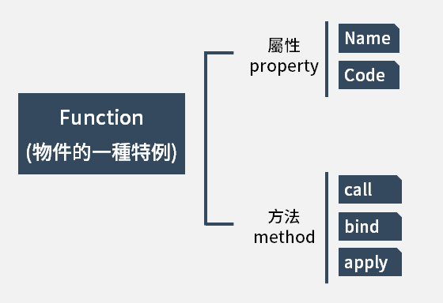

- **bind 的運作的方式，實際上是會複製你原本的function，並且將this代成你指定的物件，所以如果你要執行這個function的話，最後還要記得加上( )**。

- call的用法其實就和括號 ( ) 一樣，都是直接去執行（invoke）這個函式，但是不一樣的地方在於，call的後面可以帶入你想要指定this的物件，接著再放入參數，fun.call(thisArg[, arg1[, arg2[, ...]]])。

- apply和call的用法大同小異，唯一不同的地方在於，使用apply時，放入參數的地方，應該要放入的是陣列（array）。據老師的說明，這種apply的用法特別常用到有許多算數的地方。

這裡可以留意一下，**bind是複製原本的函式，並且將你所指定的this代入這個函式中，所以如果你要在執行這個函式的話，最後要接上( )來執行該函式；而call和apply則是將你所指定的this直接代入該function中並執行，所以最後面不用在加上( )來執行該函式**

> 兩個實際應用的範例

- function borrowing

假設我們現在建立了另一個物件叫做person2，但我想要使用person這個物件裡面的getFullName這個方法時，我們就可以利用上面所提的bind, call或apply來借用person物件裡面getFullName的這個method。

```js
/*function borrowing*/
var person2 = {
 firstname: 'Chien-Ming',
 lastname: 'Wang',
}

console.log(person.getFullName.apply(person2));
console.log(person.getFullName.call(person2));
console.log(person.getFullName.bind(person2)());
```

- function currying

先寫一個function稱做multiply，讓給予的兩個參數相乘，這時候如果我想要讓a這個參數的值變成2，只根據b去代入不同的參數值，我們就可以利用 .bind( ) 來達到function currying的效果。

在上面說明bind的時候，我們並沒有在 bind 後面代入多個參數，但在這裡我們可以寫 .bind(this, 2) 這樣寫的意思，就是我們把a這個參數設定成2，然後複製原本multiply這個function變成multipleByTwo。

這時候，如果我們去執行multipleByTwo這個函式，裡面只需要代入一個參數（也就是原本multiply裡的參數b；a已經預設為2）了，最可以直接得到 x 2的結果。

```js
function multiply(a, b){
 	return a*b;
}

var multipleByTwo = multiply.bind(this,2);

console.log(multipleByTwo(4)); // 2*4 = 8
console.log(multipleByTwo(6)); // 2*6 = 12
```

其實，使用 var multipleByTwo = multiply.bind(this, 2) 這樣的寫法，就和下面這樣的意思是一樣的：

````js
function multiplyTwo(b){
  var a = 2;
 	return a*b;
}
````

如果我想要設定a , b兩個參數的值也是可以的，只需要寫 var multipleByTwo = multiply.bind(this, 2, 5) ，這時候我就等於把 a 的參數設定成2，把 b 的參數設定成 5 ，如此，不論你在 multipleByTwo裡面代入任何的參數值，最後都會得到10的結果。

我們根據一個function，複製它來創造一個新的function並且賦予它該參數的預設值時，就稱做 **function currying** ，這種方式很常運用在算數上面。

### explain 2

[Javascript 的 this 用法](http://www.ruanyifeng.com/blog/2010/04/using_this_keyword_in_javascript.html)

```js
情況一：純粹的函數調用
這是函數的最通常用法，屬於全局性調用，因此this就代表全局對象。請看下面這段代碼，它的運行結果是1。

var x = 1;
function test() {
   console.log(this.x);
}
test(); // 1

情況二：作為對象方法的調用
函數還可以作為某個對象的方法調用，這時this就指這個上級對象。

function test() {
  console.log(this.x);
}

var obj = {};
obj.x = 1;
obj.m = test;

obj.m(); // 1

情況三 作為構造函數調用
所謂構造函數，就是通過這個函數，可以生成一個新對象。這時，this就指這個新對象。

function test() {
　this.x = 1;
}

var obj = new test();
obj.x // 1

運行結果為1。為了表明這時this不是全局對象，我們對代碼做一些改變：


var x = 2;
function test() {
  this.x = 1;
}

var obj = new test();
x // 2

運行結果為2，表明全局變量x的值根本沒變。

情況四 apply 調用
apply()是函數的一個方法，作用是改變函數的調用對象。它的第一個參數就表示改變後的調用這個函數的對象。因此，這時this指的就是這第一個參數。

var x = 0;
function test() {
　console.log(this.x);
}

var obj = {};
obj.x = 1;
obj.m = test;
obj.m.apply() // 0

apply()的參數為空時，默認調用全局對象。因此，這時的運行結果為0，證明this指的是全局對象。

如果把最後一行代碼修改為

obj.m.apply(obj); //1

運行結果就變成了1，證明了這時this代表的是對象obj。
```

[筆記\] 談談 JavaScript 中的 "this" 和它的問題](https://pjchender.blogspot.com/2016/03/javascriptthisbug.html)

```js
const objectWithThis = {
  name: 'I am the object',
  log: function () {
    this.name = 'Update current object name'
  console.log(this);

    const setNameWithFunction = function(newName) {
      this.name = newName;
      console.log(this);   // 確認 this 指稱的對象
    }
    setNameWithFunction('Update object name to "NEW NAME"');
  console.log(this);
  }
}

objectWithThis.log();


{name: "Update current object name", log: ƒ}

Window {0: global, 1: Window, 2: global, window: Window, self: Window, document: document, name: "Update object name to "NEW NAME"", location: Location, …}

{name: "Update current object name", log: ƒ}
```

那麼碰到上述這個例子時，我們可以怎麼做來避免指稱到不同的物件呢？

許多人的解法是這樣的，因為我們知道物件在指稱的時候是 by reference 的方式（不同的變數實際上是指稱到同一記憶體位置，可參考註 3），所以我們可以這樣做：

- **STEP 1**：在整個 function 的最上面加上一行 var self = this（有些人會用 var that = this）。由於 by reference 的特性，self 和 this 會指稱到同一個記憶體位置，而 this 指稱到的是原本預期該指稱到的物件 objectWithThis，所以 self 一樣會指稱到物件 objectWithThis 的記憶體位置。
- **STEP 2**： 接著，把方法 log 內原本使用的 this 都改成 self，這樣做可以確保 self 指稱到的是物件 objectWithThis 而不用擔心會像上面的例子一樣指稱到非預期的物件。

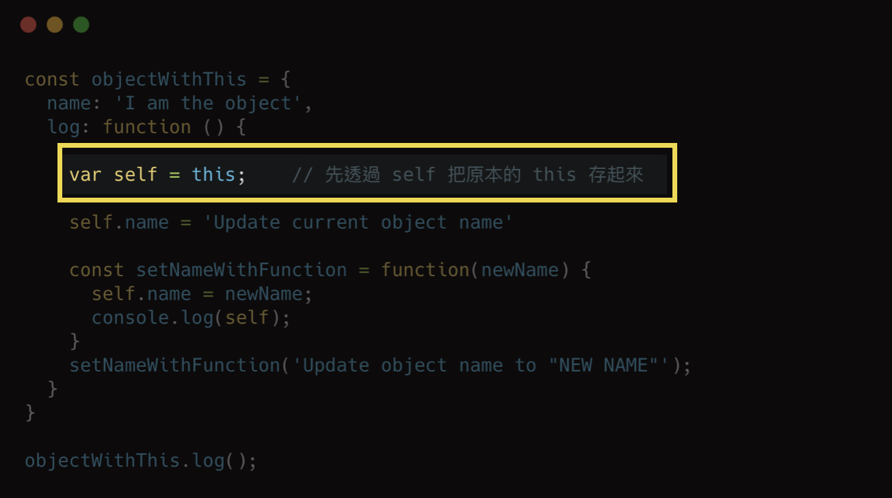

need to add ; ?

```
js一條語句的後面可以不加分號？
是否加分號是編碼風格問題，沒有應該不應該，只有你自己喜歡不喜歡。
在下面2種情況下不加分號會有問題：
  小括號開頭的前一條語句；
  中方括號開頭的前一條語句。
解決辦法：在行首加分號
強有力的例子：vue.js庫
```

## |> 原型與原型鏈

### 原型

```js
1. 函數的prototype屬性
    每個函數都有一個prototype屬性，它默認指向一個Object空對象(即稱為: 原型對象)
    原型對像中有一個屬性constructor，它指向函數對象
    構造函數 與 原型對象，相互引用。

2. 给原型对象添加属性(一般都是方法)
		作用：函数的所有实例对象自动拥有原型中的属性(方法)


console.log(Date.prototype, typeof Date.prototype)//包含的屬性給創建的實例來使用
function Fun () {

}
console.log(Fun.prototype) //默認指向一個object空對象(沒有我們的屬性)

//向原型中添加屬性(一般是方法)===>實例對象可以訪問
Fun.prototype.test = function () {
  console.log('test()')
}
console.log(Fun.prototype)

console.log(Date.prototype.constructor === Date) //true
console.log(Fun.prototype.constructor === Fun) //true

var fun = new Fun()//創建實例
fun.test()//調用test
```

### 顯示原型與隱式原型

顯示原型 prototype vs 隱式原型` __proto__`

[筆記\] 談談 JavaScript 中的 function constructor 和 prototype 的建立](https://pjchender.blogspot.com/2016/06/javascriptfunction-constructorprototype.html)

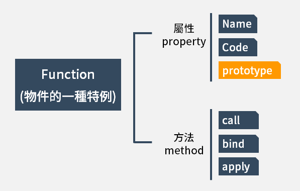

首先來說說prototype屬性，不像每個對像都有__proto__屬性來標識自己所繼承的原型，只有函數才有prototype屬性。

當你創建函數時，JS會為這個函數自動添加prototype屬性，~~值是空對象~~ **值是一個有 constructor 屬性的對象，不是空對象**。而一旦你把這個函數當作構造函數（constructor）調用（即通過new關鍵字調用），那麼JS就會幫你創建該構造函數的實例，實例繼承構造函數prototype的所有屬性和方法（實例通過設置自己的__proto__指向承構造函數的prototype來實現這種繼承）。

JS正是通過__proto__和prototype的合作實現了原型鏈，以及對象的繼承。 構造函數，通過prototype來存儲要共享的屬性和方法，也可以設置prototype指向現存的對象來繼承該對象。 對象的__proto__指向自己構造函數的prototype。 obj.__proto__.__proto__...的原型鏈由此產生，包括我們的操作符instanceof正是通過探測`obj.__proto__.__proto__... === Constructor.prototype`來驗證obj是否是Constructor的實例。

two = new Object()中Object是構造函數，所以two.__proto__就是Object.prototype。至於one，ES規範定義對象字面量的原型就是Object.prototype。

```js
1. 每個`函數function`都有一個`prototype，即顯式原型`。
2. 每個`實例對像`都有一個`__proto__，可稱為隱式原型`。
3. 實例對象的隱式原型__proto__ 等於 `構造函數`的顯式原型prototype。
4. 內存結構(圖)
5. 總結:
    函數的prototype屬性：在`定義函數時`自動添加的，默認值是一個空Object對象。
    對象的__proto__屬性：`創建對象時`自動添加的，默認值為構造函數的prototype屬性值。
    coder能直接操作顯式原型，但不能直接操作隱式原型(ES6之前)。
    
    
    
    
//定義構造函數
function Fn() { //內部語句:this.prototype = {}
  
}
// 1.每個函數都有一個prototype,就是顯示原型(屬性),默認指向一個空的Object對象
console.log(Fn.prototype)
// 2.每個實例對像都有一個__proto__,就是隱式原型(屬性)
//創建實例對象
var fn = new Fn() //內部語句:this.__proto = Fn.prototype
console.log(fn.__proto__)

// 3.對象的隱式原型的值為其對應構造函數的顯示原型的值
console.log(fn.__proto__ === Fn.prototype) //true

//給原型添加方法
Fn.prototype.test = function() {
  console.log('test()')
}
//通過實例調用原型的方法
fn.test()
```

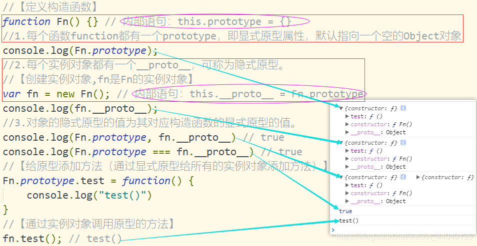

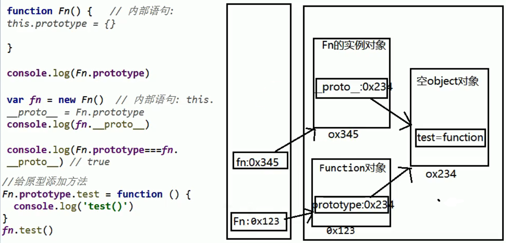

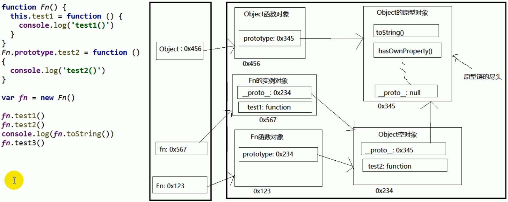

構造函數 與 原型對象，相互引用

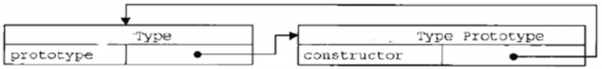


```js
順帶一提，每一個 prototype 都會有一個叫做constructor的屬性，例如說Person.prototype.constructor，而這個屬性就會指向構造函數。
Person.prototype的構造函數是什麼？當然就是Person囉。

function Person(name, age) {
  this.name = name;
  this.age = age;
}

Person.prototype.log = function () {
  console.log(this.name + ', age:' + this.age);
}

var nick = new Person('nick', 18);

// 這段是要讓大家知道，這邊其實是往原型鍊的上面去找
console.log(nick.constructor === Person); // true
console.log(nick.hasOwnProperty('constructor')); // false

// Person 的 constructor 就是 Person
console.log(Person.prototype.constructor === Person); // true
console.log(Person.prototype.hasOwnProperty('constructor')); // tru
```

### 原型鏈

```js
1. 原型鏈(圖解)
    訪問一個對象的屬性時，
    先在自身屬性中查找，找到返回
    如果沒有, 再沿著__proto__這條鏈向上查找，找到返回
    如果最終沒找到，返回undefined
    別名: 隱式原型鏈
    作用: 查找對象的屬性(方法)
2. 構造函數/原型/實體對象的關係(圖解)
3. 構造函數/原型/實體對象的關係2(圖解)


// console.log(Object)
// console.log(Object.prototype)
console.log(Object.prototype.__proto__) //null
function Fn() { //重要!內部語句:this.prototype = {}
  this.test1 = function () {
    console.log('test1()')
  }
}
console.log(Fn.prototype) //注意這裡,默認指向一個Object空對象(也是Object實例對象) 實例對象__proto__的值=構造函數Object的prototype的值
Fn.prototype.test2 = function () {
  console.log('test2()')
}
var fn = new Fn() //重要!內部語句:this.__proto = Fn.prototype
fn.test1()
fn.test2()
fn.toString() //定義在Object原型對像中的方法
console.log(fn.toString())
// fn.test3()
console.log(fn.test3) //undefined

// 原型鏈的補充
// 1.函數的顯示原型指向的對象,默認是空的Object實例對象(但Object不滿足,Object.prototype.__proto__ = null)
console.log(Fn.prototype instanceof Object) //true Fn.prototype是不是Object實例,後面有instanceof的講解
console.log(Object.prototype instanceof Object) //false
console.log(Function.prototype instanceof Object) //true
// 2.Function是它自身的實例,所有函數都是Function的實例(包含Function)
console.log(Function.__proto__ === Function.prototype) //true
// 3.Object 的原型對像是原型鏈盡頭
console.log(Object.prototype.__proto__) //null
```

[該來理解 JavaScript 的原型鍊了](https://blog.techbridge.cc/2017/04/22/javascript-prototype/)

對象`__proto__`屬性的值就是它所對應的原型對象：

```js
function Person(name, age) {
  this.name = name;
  this.age = age;
}

Person.prototype.log = function () {
  console.log(this.name + ', age:' + this.age);
}

var nick = new Person('nick', 18);

// 這個剛講過了，nick.__proto__ 會指向 Person.prototype
console.log(nick.__proto__ === Person.prototype) // true

// 那 Person.prototype.__proto__ 會指向誰呢？會指向 Object.prototype
console.log(Person.prototype.__proto__ === Object.prototype) // true

// 那 Object.prototype.__proto__ 又會指向誰呢？會指向 null，這就是原型鍊的頂端了
console.log(Object.prototype.__proto__) // null
```

如果想知道一個屬性是存在 instance 身上，還是存在於它屬於的原型鍊當中，可以用`hasOwnProperty`這個方法：

為了養成良好的習慣，實際項目最好使用` getPrototypeOf `取原型鏈，這裡只是為了方便採用`__proto__`

```js
function Person(name, age) {
  this.name = name;
  this.age = age;
}

Person.prototype.log = function () {
  console.log(this.name + ', age:' + this.age);
}

var nick = new Person('nick', 18);
console.log(nick.hasOwnProperty('log')); // false
console.log(nick.__proto__.hasOwnProperty('log')); // true
```

### 

### Object.prototype（原型鏈頂端）

#### explain 1

 絕大部分瀏覽器都支持`__proto__`這個非標準的方法訪問原型，然而它並不存在於Person.prototype 中，實際上，它是來自於Object.prototype ，與其說是一個屬性，不如說是一個getter/setter，當使用`obj.__proto__ `時，可以理解成返回了Object.getPrototypeOf(obj)。

[理解JavaScript的原型链和继承](https://blog.oyanglul.us/javascript/understand-prototype.html)

```js
這裡的類A就是所有 A.new 創建出來的實例的模板而已。而對於原型鏈語言JS來說，同意的事情要這樣做

function A(name){
  this.name = name
}
A.prototype.toString = function(){
  return this.name
}
var a = new A('hehe')
console.log('object name is:' + new A ('hehe')) // => object name is: hehe

- 這裡的怪怪的函數其實就是constructor,相當於ruby例子裡的initialize
- 而prototype上的方法toString也就是類似class模板上的方法。
```

```js
在解釋prototype之前，先解釋一下new A 到底發生了什麼
ps:這裡只是意思，但是如果真的改變 __proto__ 是非常低效的

1: // var a = new A('hehe') =>
2: var a = new Object();
3: a.__proto__ = A.prototype; (proto)
4: A.call(a, 'hehe');
其中 A.call 的意思是先把A的this設置為a，然後執行A的body也就是 this.name=name
```

__proto__ 是內部[ [Prototype ]] （說了半天原型鏈這就是牛逼閃閃的原型鏈, 指向對像或者null）的getter和setter方法（已加入[ES6規範](http://www.ecma-international.org/ ecma-262/6.0/#sec-additional-properties-of-the-object.prototype-object)，但是還是建議只使用`Object.getPrototypeOf()`）

JS對象能使用它原型鏈對象的所有方法，比如所有的對象的原型鏈（的原型鏈的原型鏈的原型鏈…）都最終會指向Object(或null)。因此，所有的對像都能使用Object.prototype上的方法，比如我之前覆蓋掉的 toString 本身就是Object.prototype上的方法，如果沒有覆蓋，它是可以拿到所有Object上的方法的：

```js
a.toString === A.prototype.toString // true
a.toLocalString === Object.prototype.toLocalString // true
a.__proto__ === A.prototype // true
```

- instanceof 運算符可以用來判斷Object的 prototype屬性 是否存在Function的 原型鏈 上。

```js
所以instanceof其實就是

Function.__proto__ === Object.prototype
// false
擦，假設失敗了呢，讓我們來看看為什麼不對，Function.__proto__到底指哪去了

Function.__proto__ === Function.prototype
//true
原來指向自己的prototype了呢，那就意味著…

Function instanceof Function
//true
yes，然而 Function instanceof Object似乎也能解釋了

Function.__proto__ === Function.prototype
Function.__proto__.__proto__ === Object.prototype
所以如果我們讓

Function.__proto__.__proto__ = null
Function instanceof Object
//false
這回知道為什麼不要用 __proto__ 了吧，一不小心重寫了會導致所有繼承自它的對像都受影響。

Object instanceof Function
這意味著

Object.__proto__ === Function.prototype
// true
// 但是Firefox取不到Object.__proto__, 看來做了保護，必須要用
// Object.getPrototypeOf(Object) === Function.prototype
```

一共就分別有兩類：

- 原型鏈指向Function.prototype的函數們
- 原型鏈指向Object.propotype的對象們

而原型鏈頂端的Object.prototype就再沒有原型鏈了，所以是空

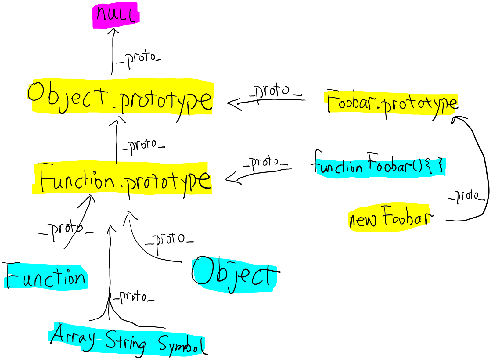

[從__proto__和prototype來深入理解JS對象和原型鏈 #9](https://github.com/creeperyang/blog/issues/9)

JS正是通過__proto__和prototype的合作實現了原型鏈，以及對象的繼承。 構造函數，通過prototype來存儲要共享的屬性和方法，也可以設置prototype指向現存的對象來繼承該對象。 對象的__proto__指向自己構造函數的prototype。 obj.__proto__.__proto__...的原型鏈由此產生，包括我們的操作符instanceof正是通過探測obj.__proto__.__proto__... === Constructor.prototype來驗證obj是否是Constructor的實例。

```js
var one = {x: 1};
var two = new Object();
one.__proto__ === Object.prototype // true
two.__proto__ === Object.prototype // true
one.toString === one.__proto__.toString // true
```

two = new Object()中Object是構造函數，所以two.__proto__就是Object.prototype。至於one，ES規範定義對象字面量的原型就是Object.prototype。

##### Object和Function的雞和蛋的問題

Object本身是構造函數，繼承了Function.prototype;

Function也是對象，繼承了Object.prototype。

這裡就有一個_雞和蛋_的問題：

```js
 Object instanceof Function // true 
 Function instanceof Object // true
```

ES規範是怎麼說的？ Function本身就是函數，

- `Function.__proto__`是標準的內置對象`Function.prototype`。 

- `Function.prototype.__proto__`是標準的內置對象`Object.prototype`。

```js
Function.prototype 和 Function.__ proto__ 都指向 Function.prototype ，這就是雞和蛋的問題怎麼出現的。

Object.prototype .__ proto__ === null, null說明原型鏈到Object.prototype 終止。
```


回歸規範，摘錄2點：

1. Function.prototype是個不同於一般函數（對象）的函數（對象）。

```js
- The Function prototype object is itself a Function object (its [[Class]] is "Function") that, when invoked, accepts any arguments and returns undefined.

- The value of the [[Prototype]] internal property of the Function prototype object is the standard built-in Object prototype object (15.2.4). The initial value of the [[Extensible]] internal property of the Function prototype object is true .

- The Function prototype object does not have a valueOf property of its own; however, it inherits the valueOf property from the Object prototype Object.

    1. Function.prototype 像普通函數一樣可以調用，但總是返回 undefined。
    2. 普通函數實際上是Function的實例，即普通函數繼承於Function.prototype。 
						func.__proto__ === Function.prototype。
    3. `Function.prototype 繼承於 Object.prototype， 並且沒有prototype這個屬性。 func.prototype 是普通對象，Function.prototype.prototype 是 null。`
    4. 所以，`Function.prototype 其實是個另類的函數，可以獨立於/先於Function產生。`
```

2. Object本身是個（構造）函數，是Function的實例，即Object.__proto__就是Function.prototype。

```js
The value of the [[Prototype]] internal property of the Object constructor is the standard built-in Function prototype object.

The value of the [[Prototype]] internal property of the Object prototype object is null, the value of the [[Class]] internal property is "Object", and the initial value of the [[Extensible]] internal property is true .
```

**最後總結：**

- 先有Object.prototype（原型鏈頂端），
- Function.prototype繼承Object.prototype而產生，
- 最後，Function和Object和其它構造函數繼承Function.prototype而產生。

> constructor

constructor是個什麼鬼,我們來玩它一下

```js
a.constructor === A.prototype.constructor
A.prototype.constructor === A
A.prototype.constructor = null
a.constructor // => null
a instanceof A // true
```

這只是函數都有的一個玩意而已, 由於js的函數可以作為構造器，也就是可以new ，所以所有的函數的prototype.constructor都指向自己，因此所有的new 出來的對像也都有一個reference能找到自己的構造器。

指向實例constructor倒是沒有，因為一個構造函數可以生成多個實例，但是原型指向構造函數倒是有的，這就要講到第三個屬性：constructor，每個原型都有一個 constructor 屬性指向關聯的構造函數。

為了驗證這一點，我們可以嘗試：

```js
function Person() {

}
console.log(Person === Person.prototype.constructor); // true

var person = new Person();
console.log(person.constructor === Person); // true

// 當獲取 person.constructor 時，其實 person 中並沒有 constructor 屬性,當不能讀取到constructor 屬性時，會從 person 的原型也就是 Person.prototype 中讀取，正好原型中有該屬性，所以： 
person.constructor === Person.prototype.constructor
```


#### explain 2

1. 每個`函數function`都有一個`prototype，即顯式原型`。
2. 每個`實例對像`都有一個`__proto__，可稱為隱式原型`。
3. `實例對象的隱式原型__proto__` 等於 `構造函數的顯式原型prototype`。

```js
函數都有prototype屬性，只是說普通函數的prototype屬性的沒有意義，`當做構造函數使用的函數的prototype屬性才有意義`。 

所有的函數對像都是Function函數的實例對象，因此這些函數的隱性原型屬性都是一樣的。然後這些函數都有各自自己的顯性原型屬性，和由通過他們自己創建的實例對象的隱性原型屬性地址值相等。

所有函數的隱式原型等於構造函數的顯示原型。是所有(構造)函數實例對象的隱式原型等於(構造)函數的顯示原型。 
  1、所有函數的`顯示原型`指向的對像是`空Object的實例對象`。 
  		Function.__proto__.__proto__ === Object.prototype
			// same as
			Function.prototype.__proto__ === Object.prototype

  2、所有函數都`是Function的實例`。
 	 		Function.__proto__ === Function.prototype

  
* Funcion Foo(){} 就是var Foo = new Function() 所以函數也是一個實例對象,包含 prototype 和 __proto__ 兩個屬性.
* 實例對象的隱式原型= 構造函數的顯示原型 然而這裡,構造函數的隱式原型和顯示原型指向同一個對象,說明它是自己創建自己Function = new Function() //自己創建的Function.__proto__ = Function.prototype.
* 所有函數的隱式原型都應相等(都是new Function()產生的).
* Object create by function.
* 函數對象的顯示原型指向對象默認是Object空實例對象(由new Object()創建的實例),但Object不滿足.
* Object原型對像是原型鏈盡頭
```


先有Object.prototype（原型鏈頂端），Function.prototype繼承Object.prototype而產生，最後，Function和Object和其它構造函數繼承Function.prototype而產生。

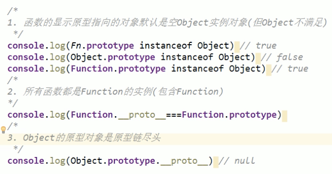

```js
// 這兩個互為彼此的 instance
console.log(Function instanceof Object); // true
console.log(Object instanceof Function); // true

// Function 的 __proto__ 會指向 Function.prototype
// 而 Function.prototype 的 __proto__ 會指向 Object.prototype
console.log(Function.__proto__ === Function.prototype); // true
console.log(Function.__proto__.__proto__ === Object.prototype); //true

// Object 的 __proto__ 會指向 Function.prototype
console.log(Object.__proto__ === Function.prototype); // true
```


### Javascript繼承機制的設計思想

[Javascript繼承機制的設計思想](http://www.ruanyifeng.com/blog/2011/06/designing_ideas_of_inheritance_mechanism_in_javascript.html)

```js
C++和Java語言都使用new命令，生成實例。
C++的寫法是：

　　ClassName *object = new ClassName(param);

Java的寫法是：

　　Foo foo = new Foo();

因此，他就把new命令引入了Javascript，用來從原型對像生成一個實例對象。但是，Javascript沒有"類"，怎麼來表示原型對象呢？

這時，他想到C++和Java使用new命令時，都會調用"類"的構造函數（constructor）。他就做了一個簡化的設計，在Javascript語言中，new命令後面跟的不是類，而是構造函數。

舉例來說，現在有一個叫做DOG的構造函數，表示狗對象的原型。

　　function DOG(name){
　　　　this.name = name;
　　}

對這個構造函數使用new，就會生成一個狗對象的實例。

　　var dogA = new DOG('大毛');
　　alert(dogA.name); // 大毛

注意構造函數中的this關鍵字，它就代表了新創建的實例對象。
```

new運算符的缺點

```js
用構造函數生成實例對象，有一個缺點，那就是無法共享屬性和方法。

比如，在DOG對象的構造函數中，設置一個實例對象的共有屬性species。

　　function DOG(name){
　　　　this.name = name;
  　　　this.species = '犬科';
　　}

然後，生成兩個實例對象：

　　var dogA = new DOG('大毛');
　　var dogB = new DOG('二毛');

這兩個對象的species屬性是獨立的，修改其中一個，不會影響到另一個。

　　dogA.species = '貓科';
　　alert(dogB.species); // 顯示"犬科"，不受dogA的影響

每一個實例對象，都有自己的屬性和方法的副本。這不僅無法做到數據共享，也是極大的資源浪費。
```

prototype屬性的引入

```js
考慮到這一點，Brendan Eich決定為構造函數設置一個prototype屬性。

這個屬性包含一個對象（以下簡稱"prototype對象"），所有實例對象需要共享的屬性和方法，都放在這個對象裡面；那些不需要共享的屬性和方法，就放在構造函數里面。

實例對像一旦創建，將自動引用prototype對象的屬性和方法。也就是說，實例對象的屬性和方法，分成兩種，一種是本地的，另一種是引用的。

還是以DOG構造函數為例，現在用prototype屬性進行改寫：

　　function DOG(name){
　　　　this.name = name;
　　}

　　DOG.prototype = { species : '犬科' };

　　var dogA = new DOG('大毛');
　　var dogB = new DOG('二毛');
　　alert(dogA.species); // 犬科
　　alert(dogB.species); // 犬科

現在，species屬性放在prototype對象裡，是兩個實例對象共享的。只要修改了prototype對象，就會同時影響到兩個實例對象。

　　DOG.prototype.species = '貓科';
　　alert(dogA.species); // 貓科
　　alert(dogB.species); // 貓科
```

總結

由於所有的實例對象共享同一個prototype對象，那麼從外界看起來，prototype對象就好像是實例對象的原型，而實例對象則好像"繼承"了prototype對像一樣。 這就是Javascript繼承機制的設計思想。

## |> 原型鏈_屬性問題

```js
1. 讀取對象的屬性值時: 會自動到原型鏈中查找
2. 設置對象的屬性值時: 不會查找原型鏈, 如果當前對像中沒有此屬性, 直接添加此屬性並設置其值
3. 方法一般定義在原型中, 屬性一般通過構造函數定義在對象本身上

// ex1
function Fn(){}
Fn.prototype.a='ppp'
let fn1 = new Fn()
console.log(fn1.a, fn1);

let fn2 = new Fn()
fn2.a='eee'
console.log(fn1.a, fn2.a, fn2);

// ex2
function Person(name, age) {
  this.name = name
  this.age = age
}
Person.prototype.setName = function(name) {
  this.name = name
}
var p1 = new Person('yang',24)
p1.setName('yue')
console.log(p1) //name:'yue',age:24

var p2 = new Person('qing',24)
p2.setName('ming')
console.log(p2) //name:'ming',age:24

console.log(p1.__proto__ === p2.__proto__) //true
```

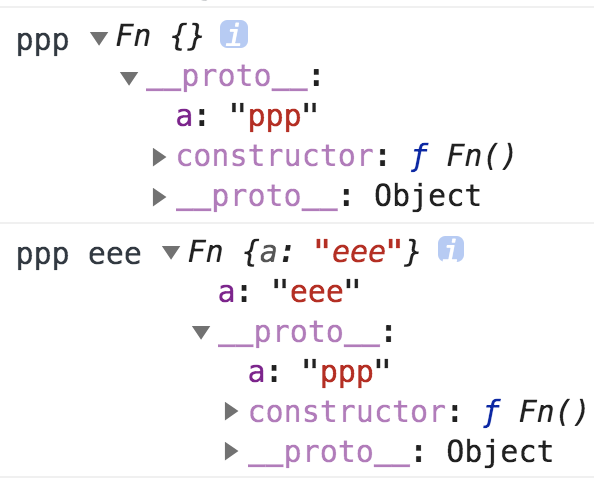


```js
1. instanceof是如何判斷的?
  * 表達式: A instanceof B
  * 如果B函數的顯式原型對像在A對象的原型鏈上, 返回true, 否則返回false
2. Function是通過new自己產生的實例

//案例1
function Foo() {}
var f1 = new Foo()
console.log(f1 instanceof Foo) // true
console.log(f1 instanceof Object) // true


//案例2
console.log(Object instanceof Function) // true
console.log(Object instanceof Object) // true
console.log(Function instanceof Function) // true
console.log(Function instanceof Object) // true

function Foo() {}
console.log(Object instanceof Foo) // false
```


## |> hosting

```js
1.變量聲明提升
  *通過var定義(聲明)的變量,在定義語句之前就可以訪問到
  *值: undefined
2.函數聲明提升
  *通過function聲明的函數,在之前就可以直接調用
  *值: 函數定義(對象)
3.問題: 變量提升 和 函數提升是如何產生的?
  
  
  
// 面試題: 輸出undefined
var a = 3
function fn () {
  console.log(a) //undefined
  var a = 4 //其實是先定義了a var a,但還未賦值
  }
fn()

console.log(b) //undefined 變量提升
fn2() //可使用 函數提升
fn3() //不可用 函數提升必須使用聲明的方式

var b = 3
function fn2() {
  console.log('fn2()')
}
var fn3 = function () {
  console.log('fn3()')
}
```


```js
(function () {
  console.log("foo: " + typeof foo); // function pointer
  console.log("bar: " + typeof bar); // undefined

  var foo = 'hello',
      bar = function() {
        return 'world';
      };
  function foo() {
    return 'hello';
  }
}());
```

現在我們可以回答關於上面這段程式碼的一些問題

- 為什麼我們在宣告之前可以存取 foo
  - 如果我們看看 `建立階段` 的流程我們可以知道變數在這個時期早就被建立了
- Foo 被宣告 2 次，為什麼 foo 是 function 而不是 undefined 或 string？
  - 即使 foo 宣告了2次，我們知道在建立階段 function 會先被建立。因此變數已經存在了在這個階段 string 不會被賦予 foo
  - 因此在真正執行 function 之前 foo 是會先被建立，等他真正跑完執行階段的時候 foo 才會被覆寫成 ‘hello’
- 為什麼 bar 是 undefined ?
  - bar 就只是一個變數，在這個階段並還沒賦值所以就是 undefined


##  |> context

```html
對於每個執行上下文，都有三個重要屬性： 
		變量對象(Variable object，VO) 作用域鏈(Scope chain) this

1.代碼分類(位置)
  *全局代碼
  *函數(局部)代碼

2.全局執行上下文
  *在執行全局代碼前將window 確定為全局執行上下文
  *對全局數據進行預處理
    1.var定義的全局變量==>undefined,添加為window的屬性
    2.function聲明的全局函數==>賦值(fun),添加為window的方法
    3.this==>賦值為window
  *開始執行全局代碼

<script type="text/javascript">
  console.log(a1, window.a1) // undefined   undefined 
  window.a2()       //a2()
  console.log(this)    //window

  var a1 = 3
  function a2() {
    console.log('a2()')
  }
  console.log(a1)    //3

</script>
```


```js
3.函數執行上下文
*在調用函數,準備執行函數體之前,創建對應的函數執行上下文對象(虛擬的,存在於棧中)
  *對局部數據進行預處理
  *形參變量==>賦值(實參),添加為執行上下文的屬性
  *argument==>賦值(實參列表),添加為執行上下文的屬性
  *var定義的局部變量==>undefined,添加為執行上下文的屬性
  *function聲明的函數 ==>賦值(fun),添加為執行上下文的方法
  *this ==>賦值(調用函數的對象)

//函數執行上下文
function fn (a1) {
  console.log(a1)
  console.log(a2)
  a3()
  console.log(this) //window
  console.log(arguments) //偽數組(2,3)
}

var a2 = 3
function a3() {
  consnole.log('a3()')
}
fn(2, 3) //函數調用後創建執行上下文
```


```js
4，執行上下文棧 
	*當有變量和函數同名時，變量提升先執行，函數提升再執行，後提升的覆蓋之前的 在代碼中，執行全局代碼時，產生一個執行上下文對象，此後，每次調用函數產生一個執行上下文對象，故而會產生n+1個。
    1.全局代碼執行前,JS引擎就會創建一個棧來存儲管理所有的執行上下文對象
    2.在全局執行上下文(window)確定後,將其添加到棧中
    3.在函數執行上下文創建後,將其添加到棧中
    4.在當前函數執行完後,將棧頂的對象移除出棧
    5.當所有的代碼執行完後,棧中只剩下window


//1.進入全局執行上下文
var a = 10
var bar = function(x) {
  var b = 5
  foo(x + b) //函數調用產生執行上下文 //3.進入foo執行上下文
}
var foo = function (y) {
  var c = 5
  console.log(a + c + y)
}
bar(10) //函數調用產生執行上下文 //2.進入bar函數執行上下文
```


面試題1

```js
console.log('gb:'+ i)
var i = 1
foo(1)
function foo(i) {
  if(i == 4){
    return
  }
  console.log('fb:' + i)
  foo(i + 1) //遞歸調用: 在函數內部調用自己
  console.log('fe:' + i)
}
console.log('ge:' + i)

1.依次輸出什麼
gb: undefined
fb: 1
fb: 2
fb: 3
fe: 3
fe: 2
fe: 1
ge: 1

2.整個過程中產生幾個執行上下文 5個
```

面試題2

```js
// 測試題1 : 先執行變量提升, 再執行函數提升
function a() {} //函數提升
var a //變量提升
console.log(typeof a) //'function'

------------------------------------------------------------------------------
// 測試題2
if (!(b in window)) { //不會進入if判斷,不會賦值
  var b = 1
  }
console.log(b) //undefined

------------------------------------------------------------------------------
// 測試題3
<script type="text/javascript">
  var c = 1
  function c(c) {
    console.log(c)
  }
  c(2) // 報錯c is not a function 
  //變量先提升：var c 
  //再函數提升：function c 
  //也就是說此時c是函數 
  //但是var c=1寫在前面，一旦函數提升完之後， 
  //就會執行c=1的賦值語句，c就變成1了，不再是函數，所以報錯
</script>
// 等價於：
<script type="text/javascript">
  var c
  function c(c) {
    console.log(c)
  }           //函数后提升，此时c是函数
  c=1    //重新赋值，c变成1了
  c(2)
</script>
```

### 理解 Javascript 執行環境

[理解 Javascript 執行環境](https://andyyou.github.io/2015/04/18/what-is-the-execution-context-in-javascript/)

> 什麼是執行環境？

我們說當 JS 開始執行的時候，這段程式碼必須被執行在下面三種環境之一。

- 全域 Global：預設當您程式開始執行時的環境(`global context`只會有一個。其他執行環境都可以存取全域的東西。)
- 函式：當我們進入一個函式 function 時的環境，也就是開始跑函式內部程式碼的時候
- Eval：把一串字串，當作指令來執行時的環境
  也就是說一段 JS 程式碼只能存在在上面這三種狀態或類型。

> 執行環境的堆疊

瀏覽器的 JS 直譯器通常是單執行緒的，意味著一次只能夠做一件事。
也就是說當一個事件被執行的時候其他的任務，事件等等就會被丟到執行佇列中。這個東西我們就叫做`執行堆疊`

我們已經知道當 JS 開始跑的時候一開始會進入 `global 執行環境`，如果您在 global 環境中呼叫了一個 `function A` (即： `A();`)，這個時候就會建立新的 `執行環境` 然後這個新的執行環境會被放到`執行堆疊`的最上面，同樣的如果你現在在 function A 裡面又叫了 function B 那麼就又會在建立一個`執行環境`一樣放到`執行堆疊`的最上方，瀏覽器永遠會先處理堆疊上最上面的執行環境，一旦執行環境裡面的任務都執行完了那它就會被移掉換下一個

關於執行環境有 5 個重點要牢記在心

- 單執行緒
- 同步執行
- 只有一個 global context
- function context 沒有限制
- 就算是自己呼叫自己只要 call function 就會建立執行環境

> 詳解執行環境

所以我們現在知道了每一次 call function 的時候就會建立一個新的執行環境，然而在 JS 直譯器內部每次調用一個執行環境都會有兩個階段

1. 建立階段

   當 function 被呼叫了但在開始執行內部程式碼之前

   - 建立一個 `scope chain` 作用域鍊
   - 建立變數，function，和參數
   - 設定 `this` 的值

2. 執行階段

   - 賦值，設定 function 的參考和解譯執行程式碼

概念上我們可以把一個 `執行環境` 想像成一個物件，那麼這個物件大概會有三個屬性如下

```js
executionContextObject = {
  scopeChain: { /* 變數物件 + 所有父代執行環境物件的變數物件*/},
  variableObject: {/* 函式的參數/引數，內部的變數和函式*/ },
  this: {}
}
```

> Variable Object 變數物件：根據 ECMA-262 的說明，每一個執行環境會有一個與相關連的變數物件，這個物件負責記錄執行環境中定義的變數和函式。

Activation / Variable Object [AO/VO]

這一個執行環境物件在 function 被調用的時候建立，不過在實際的 function 被執行之前，這就是上面提到的階段 1 - 建立階段。在這個階段直譯器會建立 `executionObject` ，透過掃描函式傳入的參數，內部的函式宣告，變數宣告。結果會被記錄在`executionObject` 的 `變數物件 variableObject` 中。


**這裏我們大致模擬直譯器是如何執行的流程**

1. 尋找呼叫 function 的程式碼

2. 在執行 function 之前建立 `執行環境`

3. 進入

   建立階段

   - 初始化 `scope chain`

   - 建立

     variable object：

     - 建立 `arguments object` 檢查執行環境的參數，初始化參數的名稱，值以及建立參考
     - 掃描 function 的宣告
       - 根據找到的每一個 function 在 `variable object` 建立，在這邊其實就是建立 function `名稱`在記憶體中的參考指標
       - 如果 function 名稱已經存在那麼指標就會被覆寫
     - 掃描執行環境裡的變數
       - 每一個變數的宣告都會被加入 `variable object` 的屬性中，並且初始化為 `undefined`，注意在這個階段並不會`賦值`
       - 如果變數名稱存在就略過，繼續處理下一個變數

   - 判斷決定 this 的值

4. 執行階段

   - 執行程式碼，賦值，一行一行跑

```js
function foo(i) {
  var a = 'hello';
  var b = function B() {

  };
  function c() {

  }
}
foo(22);
```

此時在建立階段我們就會得到如下的範例

```js
fooExecutionContext = {
  scopeChain: { ... },
  variableObject: {
    arguments: {
      0: 22,
      length: 1
    },
    i: 22,
    c: pointer to function c()
    a: undefined,
    b: undefined
  },
  this: { ... }
}
```

如您所見，在建立階段處理關於定義宣告的部分，此時並不會賦值，所以 function b 並沒有被參考。不過參數是唯一的例外，此時參數的值已經被建立。一旦建立階段完成，剩下的流程就是開始執行階段，當執行階段完成的時候`執行環境`就會如下

```js
fooExecutionContext = {
  scopeChain: { ... },
  variableObject: {
    arguments: {
      0: 22,
      length: 1
    },
    i: 22,
    c: pointer to function c()
    a: 'hello',
    b: pointer to function B()
  },
  this: { ... }
}
```

> 總結

下個收斂的結論就是

- 每一個片段程式碼都會屬於某個執行環境，或者說在開始執行程式碼之前會先建立 `執行環境`
- 執行環境比喻來說就像是一個物件負責紀錄這個 `環境` 下相關的事物 `變數` `function` 等等
- 從上往下看這個執行環境物件最重要的是 `scope chain`, `variable object`, `this` 這三個屬性
- `variable object` 才是實際上記錄變數，function，arguments 的地方
- 另外一個重要的點是 scope chain 他負責記錄每個環境之間切換的關聯，例如從 global -> a()
- 每次開始建立執行環境的時候就會分成兩個階段
- 開始建立執行環境的時間點是在 function 被呼叫後，實際執行內部程式碼前
- 建立階段，初始化這個環境，除了 arguments 外其他都只是先定義變數，函式指標，並沒有賦值
- 執行階段，開始一行一行執行，賦值
  希望現在您可以更清楚關於 Javascript 如何運行您的程式碼，瞭解執行環境，堆疊可以讓您更清楚您的程式碼在不同狀態下取到的值，如此一來相信您在組織 JS 的時候會有更好的寫法。


## |> closure

引入閉包的概念 

需求:點擊某個按鈕,提示彈出的是第n個按鈕.

```html
<!DOCTYPE html>
<html lang="en">
  <head>
    <meta charset="UTF-8">
    <meta name="viewport" content="width=device-width, initial-scale=1.0">
    <title>Document</title>
  </head>
  <body>
    <button>測試一</button>
    <button>測試二</button>
    <button>測試三</button>
    <script>
      //第一種實現方法(不能實現,因為i循環後才執行onclick)
      // var btn = document.getElementsByTagName('button')
      // for(var i = 0, length = btn.length; i < length ; i++) { //i是全局變量,i只有一個
      // var btns = btn[i]
      // btns.onclick = function () { //i循環後才執行onclick
      // alert('第'+(i+1)+'個') //i = 4
      // }
      // }

      //第二種實現方法
      // var btn = document.getElementsByTagName('button')
      // for(var i = 0,length = btn.length; i < length ; i++){
      // var btns = btn[i]
      // btns.index = i //給出每個按鈕對應的下標 save in btn
      // btns.onclick = function(){
      // alert('第'+(this.index+1)+'個')
      // }
      // }

      //使用閉包的實現方法
      var btn = document.getElementsByTagName('button')
      for(var i = 0, length = btn.length; i < length ; i++) {
        (function(i) { //i是局部變量 全局i傳給局部i,i就進入閉包
          var btns = btn[i] //i是局部變量
          btns.onclick = function () {
            alert('第'+(i+1)+'個')
          }
        })(i) //i是全局變量
      }
    </script>

  </body>
</html>
```

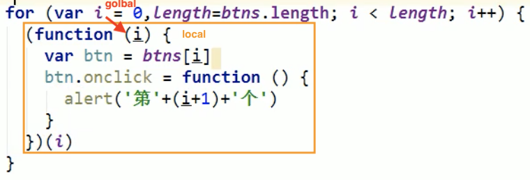

```js
1.如何產生閉包
	*當一個嵌套的內部函數(子)引用了嵌套的外部函數(父) 的 變量(函數)時,就產生了閉包
2.閉包到底是什麼
  * 使用chrome調試查看
  * 理解一: 閉包是嵌套的內部函數(絕大部分人)
  * 理解二: 包含被引用變量(函數)的對象(極少數人) 即a
  		fisrt has outer function(fn1) which contain an inner function(fn2), and the inner function(fn2) use the parameter(a) of outer function 
  * 注意: 閉包存在於嵌套的內部函數中
3.產生閉包的條件
  *函數嵌套
  *內部函數引用了外部函數的數據(變量/函數)
  *函數調用


function fn1(){
  var a = 2
  var b = 'abc'
  function fn2() { //執行函數定義,調用發fn1就執行函數定義,而不需要調用函數fn2 //執行函數定義就會產生閉包,不需要調用內部函數
    console.log(a)
  }
  return fn2
}
fn1()
```

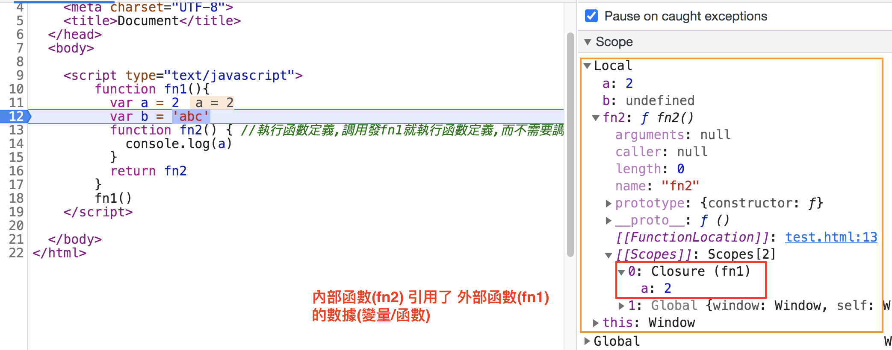

```js
常見的閉包形式:
1.將函數作為另一個函數的返回值
2.將函數作為實參傳遞給另一個函數調用
產生多少個閉包:外部函數調用幾次,產生多少個內部函數對象 ----> 調用外部函數才能產生新的閉包

// 1.將函數作為另一個函數的返回值
function fn1() {
  var a = 2
  function fn2() {
    a++
    console.log(a)
  }
  return fn2
}
var f = fn1() //存返回值fn2函數		// create closure(fn1)
f() //3 //調用內部函數fn2 //操作內部函數的變量		// invoke
f() //4 //再執行一遍 //調用內部函數fn2 //操作內部函數的變量		// invoke

// ** 因為執行外部函數才會創建內部函數對象,跟內部函數執行幾次沒有關係 **
fn1() //執行fn1()就把內部函數又創建了一遍 //看外部函數執行幾次就創建幾個閉包		// create closure(fn1)


// 2.將函數作為實參傳遞給另一個函數調用
function showDelay(msg, time) {
  setTimeout(function () {
    alert(msg) //用到了外部函數變量msg
  }, time)
}
showDelay('kate', 2000)
```


03.閉包的作用

1. 使用函數內部的變量在函數執行完後,仍然存活在內存中(延長了局部變量的生命週期)

2. 讓函數外部可以操作(讀寫)到函數內部的數據(變量/函數) , (存在才可以操作)

問題:

1. 函數執行完後,函數內部聲明的局部變量是否還存在? 一般是不存在,存在於閉包中的變量才可能存在

2. 在函數外部能直接訪問函數內部的局部變量嗎 不能,但可以通過閉包讓外部操作它

實現代碼:

```js
function fn1() {
  var a = 2
  function fn2() { //fn2和fn3都是內部變量,執行完後會被釋放
    a++
    console.log(a)
  }
  function fn3() { //fn2和fn3都是內部變量,執行完後會被釋放,fn3沒有成為垃圾對象,因為f引用著
    a-- //a被fn3函數引用了,所以進入閉包的是a
    console.log(a)
  }
  return fn3
}
var f = fn1() //f指向函數對象,把返回值存起來了,函數對象關聯著閉包,閉包裡有a //讓內部函數中的變量存活在內存
f() //1 //操作內部函數的變量
f() //0 //操作內部函數的變量
```


04.閉包的生命週期

1. 產生: 在嵌套內部函數`定義執行完`時就產生了(不是在調用的時候產生) ==> due to hosting

2. 死亡: 在嵌套的內部函數成為垃圾對象時

實現代碼:

```js
function fn1() {
  //調用fn1,閉包就已經產生了(因為函數提升,內部函數對像已經創建了)
  var a = 2
  // function fn2() {
  // a++
  // console.log(a)
  // }
  var fn2 = function() {
    a++
    console.log(a)
  }
  //產生閉包,函數定義執行,前面是函數執行
  return fn2
}
var f = fn1()
f() // 3
f() // 4
f = null //閉包死亡(包含閉包的函數對象成為了垃圾對象)
```


```js
05.閉包的應用
  閉包的應用: 定義js模塊
    * 具有特定功能的js文件
    * 將所有的數據和功能都封裝在一個函數內部(私有的)
    * 只向外暴露一個包含n個方法的對像或函數
    * 模塊的使用者,只需要通過模塊暴露的對象調用方法來實現對應的功能
```

實現代碼:
myModule.js

```js
function myModule() {
  //私有的數據
  var msg = 'bigface'
  //操作數據的函數
  function doSomething() {
    console.log('doSomething()'+ msg.toUpperCase())
  }
  function doOtherthing() {
    console.log('doOtherthing()'+ msg.toLowerCase())
  }
  //向外暴露對象(給外部使用的方法)
  return {
    // String : function
    doSomething: doSomething,
    doOtherthing: doOtherthing
  }
}
```

use

```html
<!DOCTYPE html>
<html lang="en">
  <head>
    <meta charset="UTF-8">
    <meta name="viewport" content="width=device-width, initial-scale=1.0">
    <title>Document</title>
  </head>
  <body>
    <script src="myModule.js"></script>
    <script>
			myModule() // 執行完即釋放資源（數據沒被引用，垃圾回收），沒有意義
      // var fn = myModule()
      // fn()

      //要先執行myModule(),返回對象,對象再調用方法 // closure created
      var module = myModule()
      module.doSomething()
      module.doOtherthing()
    </script>
  </body>
</html>
```


實現代碼2:
myModule2.js

```js
(function () {
    //私有的數據
    var msg = 'bigface'
    //操作數據的函數
    function doSomething() {
        console.log('doSomething()'+ msg.toUpperCase())
    }
    function doOtherthing() {
        console.log('doOtherthing()'+ msg.toLowerCase())
    }

    //要暴露的東西添加為window的屬性
    window.myModule2 = {
        doSomething: doSomething,
        doOtherthing: doOtherthing
    }

})()

// // 好處:代碼壓縮,如window可以壓縮成w
// (function (window) { 	// +window
// //私有的數據
// var msg = 'bigface'
// //操作數據的函數
// function doSomething() {
// console.log('doSomething()'+ msg.toUpperCase())
// }
// function doOtherthing() {
// console.log('doOtherthing()'+ msg.toLowerCase())
// }

// //要暴露的東西添加為window的屬性
// window.myModule2 = {
// doSomething: doSomething,
// doOtherthing: doOtherthing
// }
// })(window) 	// +window
```

Use

```js
<!DOCTYPE html>
<html lang="en">
<head>
    <meta charset="UTF-8">
    <meta name="viewport" content="width=device-width, initial-scale=1.0">
    <title>Document</title>
</head>
<body>
    <!-- 第一種方式需要先執行myModule(),第二種直接使用 兩種方式都有閉包-->
    <script src="myModule2.js"></script>
    <script>
        myModule2.doSomething()
        myModule2.doOtherthing()
    </script>
</body>
</html>
```


```js
06.閉包的缺點及解決
  1.缺點
    *函數執行完後,函數內的局部變量沒有釋放,佔用內存時間會變長
    *容易造成內存洩露
  2.解決:
    *能不用閉包就不用
    *及時釋放
```

實現代碼:

```js
function fn1() {
  var arr = new Array[100000]
  function fn2() {
    console.log(arr.length)
  }
  return fn2
}
var f = fn1() //必須讓f指向內部函數對象,不然fn1執行完arr局部變量就被釋放掉了
f()


f = null //讓內部函數成為垃圾對象-->回收閉包
```


07.面試題

```js
// 代碼片段一
//沒有閉包
var name = "the window"
var object = {
  name: "my object",
  getNameFunc: function() {
    return function() {
      return this.name	// no closure, since the inner function did not 引用 outer enviroment's parameter
    }
  }
}
alert(object.getNameFunc()()) //the window 
// object.getNameFunc() 是return 匿名fun(),
// 然後invoke匿名fun(),所以this是指window
// 任何函數本質上都是通過某個對象來調用的，如果沒有直接指定就是 window


// 代碼片段二
//有閉包:函數嵌套 和 內部函數引用外部函數變量
var name2 = "the window"
var object2 = {
  name: "my object",
  getNameFunc: function() {
    var that = this //object2
    return function() {
      return that.name2	// has closure, since the inner function  引用 outer enviroment's parameter 'that'
    }
  }
}
alert(object2.getNameFunc()()) //my object
// that save the invoker of getNameFunc(), which is object2
```

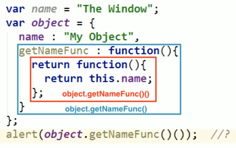

```js
function fun(n, o){
  console.log(o)	// print the data 'o' in closure, if did not create new closure(invoke outer function)
  return {
    fun:function(m){
      return fun(m,n);
    }
  }
}
var a = fun(0); a.fun(1); a.fun(2); a.fun(3);
var b= fun(1).fun(2).fun(3);
var c = fun(0).fun(1); c.fun(2); c.fun(3);

// undefined 0 0 0
// undefined 1 2
// undefined 1 1
```

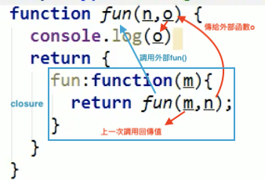

```js
補充:內存溢出與內存洩露

1.內存溢出
  * 一種程序運行出現的錯誤
  * 當程序運行需要的內存 超過了 剩餘的內存時,就出拋出內存溢出的錯誤
2.內存洩露
  *佔用的內存沒有及時釋放
  *內存洩露積累多了就容易導致內存溢出
  *常見的三種內存洩露:
      **意外的全局變量 
      **沒有及時清理的計時器或回調函數
      **閉包
```


實現代碼:

```js
// 1.內存溢出
var obj = {}
for (var i = 0;i < 10000; i++) {
  obj[i] = new Array(10000000)
  console.log('------')
}


// 2.內存洩露
// 意外的全局變量
function fn() {
  a = 3 //用var去定義變量
  console.log(a)
}
fn()

// 沒有及時清理的計時器或回調函數
var intervalId = setInterval(function () {
  console.log('------')
},1000)
clearInterval(intervalId)

// 閉包
function fn1() {
  var a = 4
  function fn2() {
    console.log(++a)
  }
  return fn2
}
var f = fn1()
f()

f = null // 讓內部函數的引用成為垃圾對象-->回收閉包
```


### 深入淺出瞭解 JavaScript 閉包（closure）

[深入淺出瞭解 JavaScript 閉包（closure）](https://pjchender.blogspot.com/2017/05/javascript-closure.html)

> 不使用閉包（closure）的情況

在 JavaScript 中，global variable 的錯用可能會使得我們的程式碼出現不可預期的錯誤。

當執行 countDogs() 或 countCats()，都會讓 count 增加，然而問題在於當我在不注意的情況下把 counter 這個變數建立在了全域的環境底下時，不論是執行 countDogs() 或是 countCats() 時，都是用到了全域的 count 變數，這使得當我執行下面的程式時，他沒有辦法分辨現在到底是在對狗計數還是對貓計數，進而導致把貓的數量和狗的數量交錯計算的情錯誤況：

```js
var count = 0

function countDogs () {
  count += 1
  console.log(count + ' dog(s)')
}


// 中間是其他程式碼...

var count = 0

function countCats () {
  count += 1
  console.log(count + ' cat(s)')
}

countCats()    // 1 cat(s)
countCats()    // 2 cat(s)
countCats()    // 3 cat(s)

countDogs()    // 4 dog(s)，我希望是 1 dog(s)
countDogs()    // 5 dog(s)，我希望是 2 dog(s)

countCats()    // 6 cat(s)，我希望是 4 cat(s)
```

> 透過閉包讓 function 能夠有 private 變數

從上面的例子我們知道，如果錯誤的使用全域變數，程式很容易會出現一些莫名其妙的 bug ，這時候我們就可以利用閉包（closure）的作法，讓函式有自己私有變數，簡單來說就是 countDogs 裡面能有一個計算 dogs 的 count 變數；而 countCats 裡面也能有一個計算 cats 的 count 變數，兩者是不會互相干擾的。

為了達到這樣的效果，我們就要建立閉包，讓變數保留在該函式中而不會被外在環境干擾。

改成閉包的寫法會像這樣：

```js
function dogHouse () {
  var count = 0
  function countDogs () {
    count += 1
    console.log(count + ' dogs')
  }
  return countDogs
}

const countDogs = dogHouse()
countDogs()    // "1 dogs"
countDogs()    // "2 dogs"
countDogs()    // "3 dogs"
```

這樣我們就將專門計算狗的變數 count 關閉在 dogHouse 這個函式中，上面這是閉包的基本寫法，**當你看到一個 function 內 return 了另一個 function，通常就是有用到閉包的概念**。

- 從程式碼中我們可以看到在 dogHouse 這個函式中裡面的 countDogs() 才是我們真正執行計數的函式，
- 而在 dogHouse 這個函式中存在 count 這個變數，由於 JavaScript 變數會被縮限在函式的執行環境中，因此這個 count 的值只有在 dogHouse 裡面才能被取用，在 dogHouse 函式外是取用不到這個值的。

- 最後因為我們要能夠執行在 dogHouse 中真正核心 countDogs() 這個函式，因此我們會在最後把這個函式給 return 出來，好讓我們可以在外面去呼叫到 dogHouse 裡面的這個 countDogs() 函式：

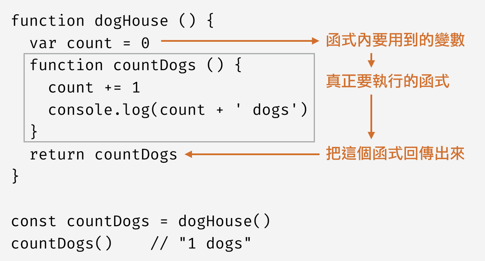

- 接著，當我們在使用閉包時，我們先把存在 dogHouse 裡面的 countDogs 拿出來用，並一樣命名為 countDogs（這裡變數名稱可以自己取），因此當我執行全域中的 countDogs 時，實際上會執行的是 dogHouse 裡面的 countDogs 函式

上面的例子就是一個很基本的閉包的寫法，一個 function 裡面包了另一個 function，同時會 return 裡面的 function 讓我們可以在外面使用到它。

> 進一步瞭解和使用閉包, 將參數代入閉包中

另外，甚至在運用的是同一個 dogHouse 時，變數間也都是獨立的執行環境不會干擾

但是這麼做你可能覺得不夠清楚，因為都是叫做 dogs，這時候我們一樣可以把外面的變數透過函式的參數代入閉包中，像是下面這樣，回傳的結果就清楚多了：

```js
// 透過函式的參數將值代入閉包中
function dogHouse (name) {
  var count = 0
  function countDogs () {
    count += 1
    console.log(count + ' ' + name)
  }
  return countDogs
}

// 同樣是使用 dogHouse 但是使用不同的參數
var countGolden = dogHouse('Golden')
var countPug = dogHouse('Pug')
var countPuppy = dogHouse('Puppy')

// 結果更清楚了
countGolden()     // 1 Golden
countGolden()     // 2 Golden

countPug()        // 1 Pug
countPuppy()      // 1 Puppy

countGolden()     // 3 Golden
countPug()        // 2 Pug
```

> 進一步簡化程式

直接 return function

接著，如果我們熟悉在閉包中會 return 一個 function 出來，我們就可以不必為裡面的函式命名，而是用[匿名函式](https://pjchender.blogspot.tw/2016/03/javascriptfunction-statements-and.html)的方式直接把它回傳出來。

因此寫法可以簡化成這樣：

```js
function dogHouse () {
  var count = 0
  // 把原本 countDogs 函式改成匿名函式直接放進來
  return function () {
    count += 1
    console.log(count + ' dogs')
  }
}

function catHouse () {
  var count = 0
  // 把原本 countCats 函式改成匿名函式直接放進來
  return function () {
    count += 1
    console.log(count + ' cats')
  }
}
```

然後我們剛剛有提到，可以透過函式參數的方式把值代入閉包當中，因此實際上我們只需要一個 counter ，在不同的時間點給它參數區分就好。這樣子不管你是要記錄哪一種動物都很方便，而且程式碼也相當簡潔：

```js
function createCounter (name) {
  var count = 0
  return function () {
    count++
    console.log(count + ' ' + name)
  }
}

const dogCounter = createCounter('dog')
const catCounter = createCounter('cat')
const birdCounter = createCounter('bird')

dogCounter()     // 1 dog
dogCounter()     // 2 dog
catCounter()     // 1 cat
catCounter()     // 2 cat
birdCounter()    // 1 brid
dogCounter()     // 3 dog
catCounter()     // 3 cat
```

> 閉包的實際應用

在 HTML 中我們先建立三個按鍵

```
<button id="first">First</button>
<button id="second">Second</button>
<button id="third">Third</button>
```

接著我們希望能夠讓這三個按鈕被點擊的時候可以回傳按鈕的文字到 console 上，因此直覺上我們可能會這樣寫：

```js
var buttons = document.getElementsByTagName('button')

for (var i = 0; i < buttons.length; i ++) {
  // buttonName 暴露於 global environment
  var buttonName =  buttons[i].innerHTML
   buttons[i].addEventListener('click', function () {
    console.log(buttonName)
  })
}
```

這時候可能會預期點選不同的按鈕時，會根據每個 button 內容的不同而得到不同的結果。但是實際執行後，你會發現回傳的結果都是 “Third”。

之所以會這樣是因為 JavaScript 是在按鍵被點擊的時候才會執行 addEventListener 裡面的 callback function ，這時候它發現要使用到 buttonName 這個變數，於是它向外層去尋找，這時候它會找到的已經是處於 global 的 buttonName，而值會是 ‘Third’。往外找的行為並不是 closure 而是 global environment 和 scope chain 的概念

因為 buttonName 這個變數是暴露在 global environment，所以他不會被保存在 function 中。我們若想把這個變數保存在 function 內，我們就可以使用到上面所講述的 closure 的概念：

```js
// 建立一個閉包把資料存在這個 function 當中
function saveButtonName (buttonName){
  // buttonName 被儲存在閉包當中
  var buttonName = buttonName
  return function(){
    console.log(buttonName)
  }
}

var buttons = document.getElementsByTagName('button')
for (var i = 0; i < buttons.length; i ++) {
  var buttonName =  buttons[i].innerHTML
   buttons[i].addEventListener('click', saveButtonName(buttonName))
}
```

這時候我們就可以把跑迴圈時的 buttonName 的值存在閉包當中，當按鈕被點擊時會執行 saveButtonName 這個 function，而它在這個 function 裡面就可以找到 buttonName 的值，因此他不需要在到外層的 global 去找 buttonName 的值。

> 使用 let

在 ES6 中提出了新的用來定義變數的關鍵字 let ，簡單來說，透過 let 它可以幫我們把所定義的變數縮限在 block scoped 中，也就是變數的作用域只有在 { } 內，因此要解決上面程式碼的問題，我們也可以透過 let 來避免 buttonName 這個變數跑到 global variable 被重複覆蓋。

寫法如下：

```js
// 使用 ES6 寫法
for (var i = 0; i < buttons.length; i ++) {
  let buttonName =  buttons[i].innerHTML
   buttons[i].addEventListener('click', saveButtonName(buttonName))
}
```

如此一樣能得到我們想要的結果


## |> 作用域與作用域鏈

```js
01.作用域
  1.什麼是作用域(理解)
    *就是一塊“地盤”,一個代碼段所在的區域
    *它是靜態的(相對於上下文對象),在編寫代碼時確定了
  2.分類
    *全局作用域
    *函數作用域
    *沒有塊作用域(ES6有了)
  3.作用
    *隔離變量,不同作用域下同名變量不會有衝突
```

實現代碼:

```js
if (true) {
  var c = 3
  }
console.log(c) //能打印出c,說明不存在塊作用域


var a = 10,
    b = 20
function fn(x) {
  var a = 100,
      c = 300
  console.log('fn()', a, b, c, x) // 100 20 300 10
  function bar(x){
    var a = 1000,
        d = 400
    console.log('bar()', a, b, c, d, x) //1000 20 300 400 100/200
  }
  bar(100)
  bar(200)
}
fn(10)
```


上述代碼的作用域如下圖:

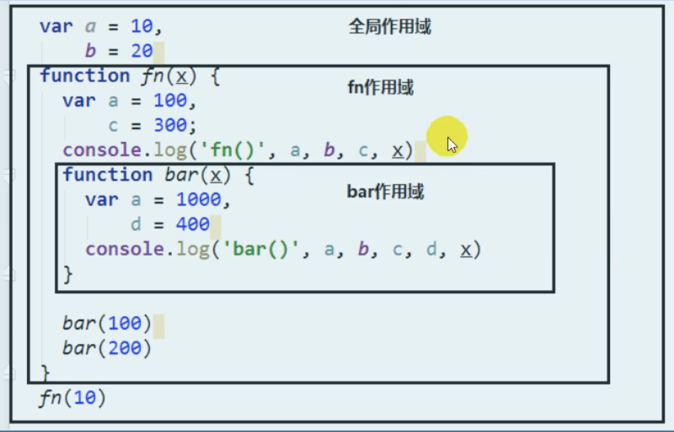


```js
02.作用域與執行上下文
  1.區別1
    *全局作用域之外,每個函數都會創建自己的作用域(n+1個作用域),作用域在函數定義時就已經確定,而不是在函數調用的時候
    *全局執行上下文環境是在全局作用域確定之後,js代碼馬上執行之前創建
    *函數執行上下文是在調用函數時,函數體代碼執行之前創建
  2.區別2
    *作用域是靜態的,只要函數定義好了就一直存在,且不會再變化
    *執行上下文是動態的,調用函數時創建,函數調用結束時上下文環境就會自動被釋放
  3.聯繫
    *執行上下文環境是從屬於所在的作用域的(關係圖)
    *全局上下文環境==>全局作用域
    *函數上下文環境==>對應的函數作用域
```

執行上下文環境是從屬於所在的作用域的(關係圖):

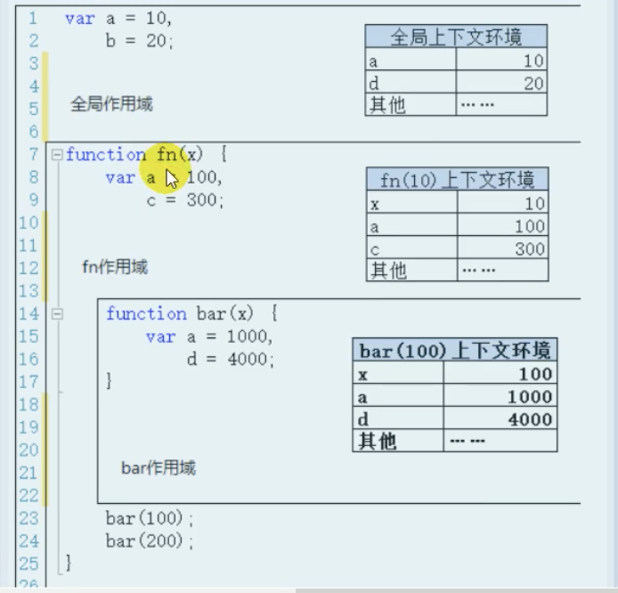

變量的查找:所在函數的作用域從裡到外沿著作用域鏈查找.

```js
03.作用域鏈
  1.理解
    *多個上下級關係的作用域形成的鏈,它的方向是從下向上的(從內到外)
    *查找變量時就是沿著作用域鏈來查找的
  2.查找一個變量的查找規則
    *在當前作用域下的執行上下文中查找對應的屬性,如果有直接返回,否則進入2
    *在上一級作用域的執行上下文中查找對應的屬性,如果有直接返回,否則進入3
    *再次執行2的相同操作,直到全局作用域,如果還找不到就拋出找不到的異常
```

實現代碼:

```js
var a = 1
function fn1(){
  var b = 2
  function fn2(){
    var c = 3
    console.log(c) //3
    console.log(b) //2
    console.log(a) //1
    console.log(d) // 報錯
  }
  fn2()
}
fn1()
```


04.作用域_面試題1

```js
<!-- 作用域_面試題1 -->

  var x = 10
function fn() { //fn作用域,作用域中找x,沒有就到外部作用域找
  console.log(x) // 10
}
function show(f) {
  var x = 20
  f()
}
show(fn) //將函數fn作為參數傳遞
```

作用域_面試題2

```js
var fn = function () {
  console.log(fn) //輸出fn函數
}
fn()


var obj = {
  fn2: function() {
    console.log(fn2) //報錯 //先在函數內部找,找不到fn2,再到外部找也找不到
    //console.log(this.fn2) //加上this就可以找到
  }
}
obj.fn2()
```


## |> 對象創建模式

> 方式一: Object構造函數模式

套路: 先創建空Object對象, 再動態添加屬性/方法
適用場景: 起始時不確定對象內部數據
問題: 語句太多

實現代碼:

```js
var p = new Object()
p.name = 'kate'
p.age = 26
p.setName = function (name) {
  this.name = name
}


//測試
p.setName('yang')
console.log(p.name, p.age)
```


> 方式二: 對象字面量模式

套路: 使用{}創建對象,同時指定屬性/方法
適用場景: 起始時對象內部數據是確定的
問題: 如果創建多個對象,有重複代碼

實現代碼:

```js
var p = {
  name: 'Tom',
  age: 12,
  setName: function(name) {
    this.name = name
  }
}


//測試
console.log(p.name, p.age)
p.setName('yang')
console.log(p.name, p.age)

var p2 = { //創建多個對象代碼很重複
  name: 'Bob',
  age: 13,
  setName: function(name) {
    this.name = name
  }
}
```


> 方式三:工廠模式

套路: 通過工廠函數動態創建對象並返回
適用場景: 需要創建多個對象
問題: 對像沒有一個具體的類型,都是Object類型

實現代碼:

```js
function createPerson (name, age) { //工廠函數:返回一個對象的函數
  var obj = {
    name: name,
    age: age,
    setName: function(name) {
      this.name = name
    }
  }
  return obj
}


// 創建兩個人
var p1 = createPerson('yang', 26)
var p2 = createPerson('qing', 24)
//p1/p2都是Object類型

function createStudent(name, price) {
  var obj = {
    name: name,
    price: price,
    setName: function(name) {
      this.name = name
    }
  }
}
var s1 = createStudent('張', 1200000)
//s1是Object類型
```


> 方式四: 自定義構造函數模式

套路: 自定義構造函數,通過new創建對象
適用場景: 需要創建多個類型確定的對象
問題: 每個對像都有相同的數據,浪費內存
實現代碼:

```js
// 定義類型
function Person(name, age) {
  this.name = name
  this.age = age
  this.setName = function(name) {
    this.name = name
  }
}
var p1 = new Person('kate', 26)
p1.setName('yang')
console.log(p1.name, p1.age)
console.log(p1 instanceof Person)


function Student(name, price) {
  this.name = name
  this.price = price
}
var s1 = new Student('Bob', 120000)
console.log(s1 instanceof Student)

var p2 = new Person('JACK', 23)
console.log(p1, p2) //圖解 //p1 和 p2擁有相同的方法,應該把方法提取出來放在它們的原型對像上
```

存在問題:每個對像都有相同的數據(如下圖打印的p1和p2對象,都包含相同方法setName)

> 方式五:構造函數+原型組合模式

*套路:自定義構造函數,屬性在函數中初始化,方法添加到原型上
*適用場景:需要創建多個類型確定的對象

實現代碼:

```js
function Person(name, age) { //在構造函數中只初始化一般函數
  this.name = name
  this.age = age
  this.setName = function(name) {
    this.name = name
  }
}
Person.prototype.setName = function(name) {
  this.name = name //this 是 實例對象,因為方法是給實例對像用的
}


var p1 = new Person('Tom', 26)
var p2 = new Person('Jack', 24)
console.log(p1, p2)
```

### ES6 物件實字威力加強版 (Enhanced Object Literals)

[ES6 物件實字威力加強版 (Enhanced Object Literals)](https://ithelp.ithome.com.tw/articles/10208316)

> 1. 物件屬性初始化的語法簡寫

ES5

時常會有這樣的情境：要使用已存在的變數名稱對物件屬性作初始化，而命名習性的關係，變數名稱可能和屬性名稱一模一樣。

```js
function getPlayerObj(name, progress){
    return {
	    name: name,
		progress: progress
	};
}

console.log( getPlayerObj("OneJar", 23) );   // {name: "OneJar", progress: 23}
```

ES6

對於這種「**屬性名稱**和**進行賦值的變數名稱**一模一樣」的情境，ES6 提供了更簡潔的語法：

```js
function getPlayerObj(name, progress){
    return {
	    name,
			progress
	};
}

console.log( getPlayerObj("OneJar", 23) );   // {name: "OneJar", progress: 23}
```

> 2. 物件函式的語法簡寫

ES5

ES5 以前，物件函式的宣告方式就是使用 `function` 關鍵字進行函數的定義：

```js
function getPlayerObj(name, progress){
    return {
        sayHi: function(){
		   return `Hi, I am ${name}`;
	    }
	};
}

console.log( getPlayerObj("OneJar", 23).sayHi() ); // "Hi, I am OneJar"
```

ES6

ES6 支援更簡潔的寫法，省略了 `function` 關鍵字和冒號 `:`：

```js
function getPlayerObj(name, progress){
    return {
        sayHi(){
		   return `Hi, I am ${name}`;
	    }
	};
}

console.log( getPlayerObj("OneJar", 23).sayHi() ); // "Hi, I am OneJar"
```

> 注意！ES6 簡寫語法的函數視為傳統函數

物件函式寫法除了**用 `function` 關鍵字定義傳統函數**，也可以用**箭頭函數 (Arrow Functions)** 的方式定義：

```js
function getPlayerObj(name, progress){
    return {
        sayHi: () => {
		   return `Hi, I am ${name}`;
	    }
	};
}
```

例如箭頭函數不會為自己產生一個新的 `arguments` 物件，如果使用 `arguments` 發生錯誤，就代表是箭頭函數：

```js
var player = {
	sayHi: (name) => {
        console.log(arguments); // ReferenceError: arguments is not defined
		return `Hi, I am ${name}`;
	}
};

console.log( player.sayHi("OneJar") );
```

若能正常取到屬於這個函數的 `arguments`，就代表是傳統函數：

```js
var player = {
	sayHi(name){
        console.log(arguments); // Arguments(1) ["OneJar"]
		return `Hi, I am ${name}`;
	}
};

console.log( player.sayHi("OneJar") ); // "Hi, I am OneJar"
```

> 3. 具運算性的屬性名稱

ES5

ES5 以前的物件實字語法，無法透過運算去定義屬性名稱。

例如無法在程式執行過程，透過運算來動態決定下面 `player` 物件裡的屬性名稱要叫 `language1` 或是 `lng1`：

```js
var player = {
	language1: "JavaScript",
	language2: "Java",
	language3: "C"
};

var player = {
	lng1: "JavaScript",
	lng2: "Java",
	lng3: "C"
};
```

當然，你還是可以用以下的寫法去達到目的：

```js
var prefix = "lng";
var i = 0;

var player = {};
player[prefix + (++i)] = "JavaScript";
player[prefix + (++i)] = "Java";
player[prefix + (++i)] = "C";

console.log(player); // {lng1: "JavaScript", lng2: "Java", lng3: "C"}
```

只是這種寫法就不是所謂的物件實字而已。

ES6

ES6 直接在物件實字的語法內增加可運算的特性，算是提供了另一種語法選擇：

```js
var prefix = "lng";
var i = 0;

var player = {
    [prefix + (++i)]: "JavaScript",
    [prefix + (++i)]: "Java",
    [prefix + (++i)]: "C"
};

console.log(player); // {lng1: "JavaScript", lng2: "Java", lng3: "C"}
```

## |> 繼承模式

01.原型鏈繼承

```js
方式一: 原型鏈繼承
  1.套路
    1.定義父類型構造函數
    2.給父類型的原型添加方法
    3.定義子類型構造函數
    4.創建父類型的對象賦值給子類型的原型
    5.將子類型的構造屬性設置為子類型
    6.給子類型原型添加方法
    7.創建子類型的對象,可以調用父類型的方法
  2.關鍵
    1.子類型的原型為父類型的一個實際對象
```


實現代碼:

```js
//父類型
function Supper() {
  this.supProp = 'Supper property'
}
Supper.prototype.showSupperProp = function () {
  console.log(this.supProp)
}


//子類型
function Sub() {
  this.subProp = 'Sub property'
}

//子類型的原型為父類型的一個實例對象
Sub.prototype = new Supper()
//讓子類型的原型的constructor指向子類型(構造函數)
Sub.prototype.constructor = Sub

Sub.prototype.showSubProp = function () {
  console.log(this.subProp)
}
var sub = new Sub()
sub.showSupperProp() // Supper property //能執行說明有繼承
sub.showSubProp()
sub.toString() // "[object Object]" 
// 能夠訪問,查找順序:Sub--->Sub.prototype(Object實例)--->Object原型對象 
// toString() 是 Object原型對象 上的方法
// Sub.prototype = {}


//如果不加Sub.prototype.constructor = Sub
console.log(sub.constructor)//會指向Supper(錯誤) 
// ƒ Supper() {
//  this.supProp = 'Supper property'
// }
// constructor是原型對像上的屬性,而現在的原型對像是new Supper()的實例,去讀constructor讀的是Supper
console.log(sub) // Sub {subProp: "Sub property"}
//(圖解)看constructor在哪裡,Sub--->Supper--->Object
```

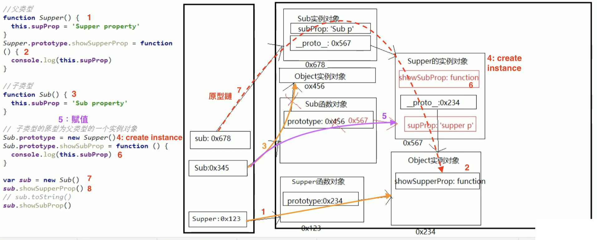


02.借用構造函數繼承

```js
方式2: 借用構造函數繼承(假的)
  1.套路:
    1.定義父類型構造函數
    2.定義子類型構造函數
    3.在子類型構造函數中調用父類型構造
  2.關鍵
    1.在子類型構造函數中調用call()調用父類型構造函數
```


實現代碼:

```js
function Person(name, age) {
  this.name = name
  this.age = age
}
function Student(name, age, price) {
  Person.call(this, name, age) //this.Person(name, age)
  // 相當於
  // this.name = name
  // this.age = age


  this.price = price
}
var s = new Student('Tom', 12, 120000)
console.log(s.name, s.age, s.price)
```

03.組合繼承
實現代碼:

```js
function Person(name, age) {
  this.name = name
  this.age = age
}
Person.prototype.setName = function(name) {
  this.name = name
}
function Student(name, age, price) {
  Person.call(this, name, age) //為了得到屬性
  this.price = price
}
Student.prototype = new Person() //為了能看到父類型的方法,所以創建實例的時候不需要傳入參數
Student.prototype.constructor = Student //修正constructor屬性
Student.prototype.setPrice = function(price) {
  this.price = price
}
var s1 = new Student('kate', 26, 12000)
s1.setName('yue')
s1.setPrice(16000)
console.log(s1.name, s1.age, s1.price)
```


## |> 線程機制與事件機制

```js
01進程與線程
  1.進程
    *程序的一次執行,它佔有一片獨有的內存空間
    *可以通過windows任務管理器查看進程
  2.線程
    *是進程內的一個獨立執行單元
    *是程序執行的一個完整流程
    *是cpu的最小的調度單元
  3.圖解

  4.相關知識
    *應用程序必須運行在某個進程的某個線程上
    *一個進程中至少有一個運行的線程:主線程,進程啟動後自動創建
    *一個進程中也可以運行多個線程,我們會說程序是多線程運行的
    *一個進程內的數據可以供其中的多個線程直接共享
    *多個進程之間的數據是不能直接共享
    *線程池(thread pool): 保存多個線程對象的容器,實現線程對象的反複利用
  5.相關問題
    1.何為多進程與多線程?
      *多進程運行:一應用程序可以同時啟動多個實例運行
      *多線程:在一個進程內,同時有多個線程運行
    2.比較單線程與多線程?
      *單線程
        優點:順序編程簡單易懂
        缺點:效率低
      *多線程(在同一時刻同時執行多個線程)
        優點:能有效提升cpu的利用率
        缺點:創建多線程開銷;線程間切換開銷;死鎖與狀態同步問題
    3.js是單線程還是多線程
      js是單線程運行的
      但使用h5中的web workers可以多線程運行
    4.瀏覽器運行是單線程還是多線程 多線程
    5.瀏覽器運行是單進程還是多進程
    	有的單進程(firefox,老版ie),有的多進程(chrome,新版ie)
```


```js
02瀏覽器內核
  瀏覽器內核
  * 支撐瀏覽器運行最核心的程序
  * 不同的瀏覽器可能不一樣
    **chrome,safari: webkit
    **firefox:Gecko
    **IE:Trident

  * 內核由很多模塊組成
    主線程
      **js引擎模塊: 負責js程序的編譯與運行
      **html,css文檔解析模塊:負責頁面文本的解析
      **DOM/CSS模塊:負責dom/css在內存中的相關處理,最終要把他們轉換成對象
      **佈局和渲染模塊:負責頁面的佈局和效果的繪製(內存中的對象)
    分線程
      **定時器模塊:負責定時器的管理
      **事件響應模塊:負責事件的管理
      **網絡請求模塊:負責ajax請求
```


```js
03定時器引發的思考
  1.定時器真是定時執行的嗎?
    *定時器並不能保證真正定時執行
    *一般會延遲一丁點(可以接受),也有可能延遲很長時間(不能接受)
  2.定時器回調函數是在分線程執行的嗎
  	*在主線程執行的,js是單線程的
  3.定時器是如何實現的?
  	*事件循環模型	
```


實現代碼:

```html
<!DOCTYPE html>
<html lang="en">
<head>
    <meta charset="UTF-8">
    <meta name="viewport" content="width=device-width, initial-scale=1.0">
    <title>定時器引發的思考</title>
</head>
<body>
    <button id="btn">啟動定時器</button>
    <script>
        document.getElementById("btn").onclick = function() {
            var start = Date.now()
            console.log('啟動定時器前')
            setTimeout(function() {
                console.log('定時器執行了',Date.now()-start)
            },200)
            console.log('啟動定時器後')
        }

        //做一個長時間的工作
        for(var i = 0;i < 100000000; i++) {
    
        }
    </script>

</body>
</html>
```


```js
04.js是單線程的
  1.如何證明js執行是單線程的
    *setTimeout()的回調函數是在主線程執行的
    *定時器回調函數只有在運行棧中的代碼全部執行完後才有可能執行
  2.為什麼js要用單線程模式,而不用多線程模式
    *js的單線程,與它的用途有關
    *作為瀏覽器腳本語言,js的主要用途是與用戶互動,以及操作DOM
    *這決定了它只能是單線程,否則會帶來很複雜的同步問題
        舉個例子:有一個p標籤,同時有兩個進程對它做更新和刪除操作,開啟兩個進程在執行的時候是一個進程操作一段時間就切換另一個進程操作一段時間,而當第一個進程對p對像操作更新後,切換另一進程操作刪除,再次切換為第一個進程操作更新時p對像已經不在了.
  3.代碼的分類:
    *初始化代碼
    *回調代碼
  4.js引擎執行代碼的基本流程
    *先執行初始化代碼:包含一些特別的代碼 回調函數(異步執行)
    *設置定時器
    *綁定監聽
    *發送ajax請求
    *後面在某個時刻才會執行回調代碼
```

實現代碼:

```js
setTimeout(function() {
  console.log('timeout 2222')
  alert('22222')
},2000)
setTimeout(function() {
  console.log('timeout 1111')
  alert('11111') //說明回調函數也是運行在主線程,因為在這裡插入alert,後面定時2s也停止了計時
},1000)
setTimeout(function() {
  console.log('timeout 0000') //alert之後輸出timeout 0000 //先執行初始化代碼,後面在某個時刻才會執行回調代碼
},0)
function fn () {
  console.log('fn()')
}
fn()


console.log('alert()之前')
alert('------')//暫停當前主線程的執行,同時暫停了計時,點擊確定後恢復程序執行和計時
console.log('alert()之後')
```


```js
05.事件循環模型
  1.所有代碼分類
    *初始化執行代碼(同步代碼): 包含綁定dom事件,設置定時器,發送ajax請求的代碼
    *回調執行代碼(異步代碼): 處理回調邏輯
  2.js引擎執行代碼的基本流程:
    *初始化代碼===>回調代碼
  3.模型的2個重要組成部分:
    *事件管理模塊:定時器管理模塊 和 Dom事件管理模塊 AJAX管理模塊
    *回調隊列
  4.模型的運轉流程(模型原理圖)
    *執行初始化代碼,將事件回調函數交給對應模塊管理
    *當事件發生時,管理模塊會將回調函數及其數據添加到回調隊列中
    *只有當初始化代碼執行完後(可能要一定時間),才會遍歷讀取回調隊列中的回調函數執行
```


實現代碼:

```html
<!DOCTYPE html>
<html lang="en">
<head>
    <meta charset="UTF-8">
    <meta name="viewport" content="width=device-width, initial-scale=1.0">
    <title>Document</title>
</head>
<body>
    <button id="btn">測試</button>
    <script>
        function fn1 () {
            console.log('fn1()')
        }
        fn1()
        document.getElementById("btn").onclick = function () {
            console.log('點擊了btn')
        }
        setTimeout(function() {
            console.log('定時器執行了')
        }, 2000)
        function fn2 () {
            console.log('fn2()')
        }
        fn2()
    </script>
</body>
</html>
1
```


模型原理圖:

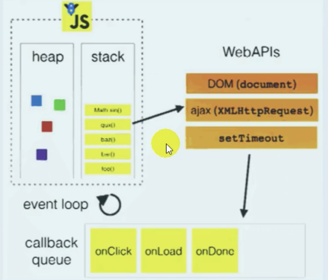

相關概念:


```js
06.web workers
  1.H5規範提供了js分線程的實現,取名為web workers
  2.相關api
    *Worker: 構造函數, 加載分線程執行的js文件
    *Worker.prototype.onmessage: 用於接收另一線程的回調函數
    *Worker.prototype.postMessage: 向另一線程發送消息
  3.不足
    *不能跨域加載js
    *worker內代碼不能訪問dom(更新ui)(全局對像不再是window)
    *不是每個瀏覽器都支持這個新特性

H5 Web Workers
  介紹
    *Web Workers是html5提供的一個javascript多線程解決方案
    *我們可以將一些大計算量的代碼交由web worker運行而不凍結用戶界面
    *但是子線程完全受主線程控制,且不得操作dom
    *所以這個新標準並沒有改變javascript單線程的本質
  使用
    *創建在分線程執行的js文件
    *在主線程中的js中發消息並設置回調
```


實現代碼1:(實現斐波那契數列)

```html
<!DOCTYPE html>
<html lang="en">
<head>
    <meta charset="UTF-8">
    <meta name="viewport" content="width=device-width, initial-scale=1.0">
    <title>Document</title>
</head>
<body>
    <input type="text" placeholder="數值" id="num">
    <button id="btn">計算</button>
    <script>
        //1 1 2 3 5 8 13 21 34 f(n) = f(n-1)+f(n-2)
        function fibonacci(n) {
            return n<=2 ? 1 : fibonacci(n-1) + fibonacci(n-2) //遞歸調用
        }
        var input = document.getElementById("num")
        document.getElementById("btn").onclick = function() {
            var number = input.value
            var result = fibonacci(number)
            console.log(result)
        }
    </script>
</body>
</html>
```

使用web workers實現斐波那契數列:

```html
<!DOCTYPE html>
<html lang="en">
<head>
    <meta charset="UTF-8">
    <meta name="viewport" content="width=device-width, initial-scale=1.0">
    <title>Document</title>
</head>
<body>
    <input type="text" placeholder="數值" id="num">
    <button id="btn">計算</button>
    <script>
        //1 1 2 3 5 8 13 21 34 f(n) = f(n-1)+f(n-2)
        var input = document.getElementById("num")
        document.getElementById("btn").onclick = function() {
            var number = input.value


            //創建一個worker對象
            var worker = new Worker('worker.js')
            //綁定接收消息的監聽
            worker.onmessage = function(event) {
                console.log('主線程接收分線程返回的數據: '+event.data)
                alert(event.data)
            }
            //向分線程發送消息
            worker.postMessage(number)
            console.log('主線程向分線程發送數據: '+number)
        }
        
    </script>

</body>
</html>
```

worker.js

```js
function fibonacci(n) {
    return n<=2 ? 1 : fibonacci(n-1) + fibonacci(n-2) //遞歸調用
}
var onmessage = function (event) {
    var number = event.data
    console.log('分線程接收到主線程發送的數據: '+ number)
    //計算
    var result = fibonacci(number)
    postMessage(result)
    console.log('分線程向主線程返回的數據: '+result)
    //alert(result) //alert是window方法,在分線程不能調用

    //分線程中的全局對像不再是window,所以在分線程中不可能更新界面
}
```

圖解:


